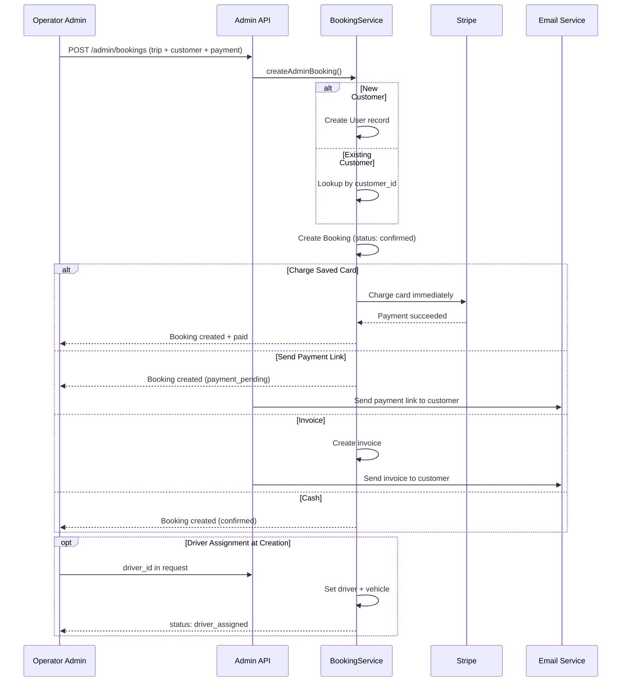
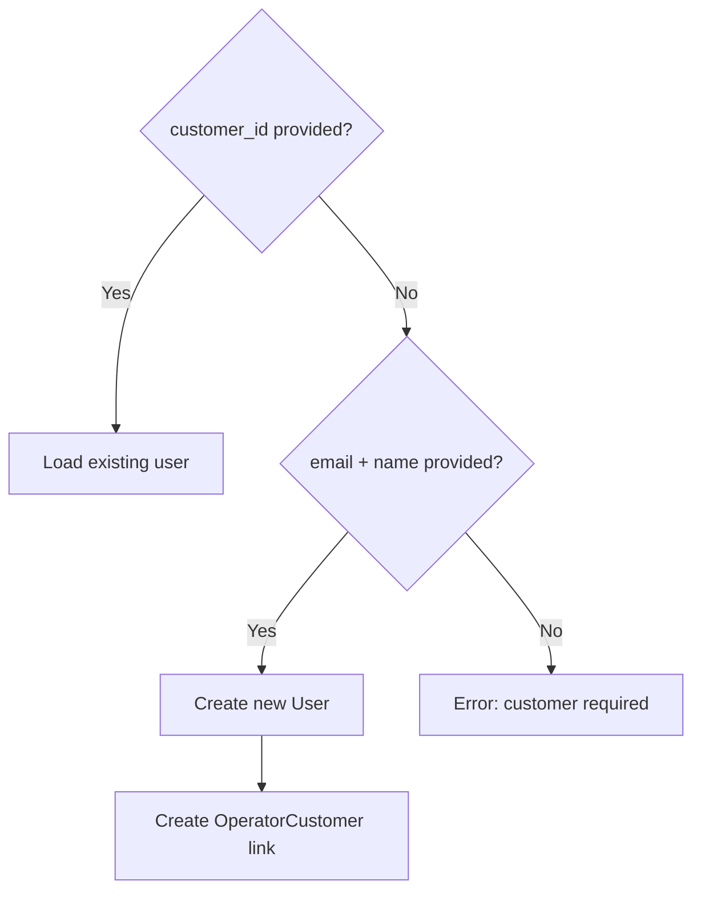

# Admin-Created Booking

Operator admin creates a booking manually — typically for phone bookings, walk-ins, or on behalf of a customer.

## Actors

- **Operator Admin** — creates booking, assigns driver, manages payment

## Entry Points

| Channel | URL | Controller |
|---------|-----|------------|
| Admin Portal | `POST /api/v1/admin/bookings` | `Api\Admin\BookingController::store()` |

## Flow Diagram



## Step-by-Step

### 1. Create Booking

```
POST /api/v1/admin/bookings
```

| Field | Required | Description |
|-------|----------|-------------|
| **Trip Details** | | |
| `service_type` | Yes | `point_to_point`, `airport_transfer`, `hourly`, `wedding` |
| `pickup_address`, `pickup_latitude`, `pickup_longitude` | Yes | Pickup location |
| `dropoff_address`, `dropoff_latitude`, `dropoff_longitude` | Yes | Dropoff location |
| `pickup_datetime` | Yes | Can be past (for already-completed trips) |
| `vehicle_type_id` | Yes | Must belong to operator |
| `passenger_count` | Yes | 1-50 |
| **Customer** | | |
| `customer_id` | No | Existing customer ID |
| `first_name`, `last_name`, `email`, `phone` | No | Create new customer (if no customer_id) |
| **Payment** | | |
| `payment_method` | No | `card`, `invoice`, `cash` |
| `card_action` | No | `charge_saved` or `send_link` (if card) |
| `card_payment_method_id` | No | Saved card to charge (if charge_saved) |
| `price_override` | No | Admin sets price directly (skips calculation) |
| **Assignment** | | |
| `driver_id` | No | Assign driver immediately |
| `vehicle_id` | No | Assign specific vehicle |
| **Other** | | |
| `admin_notes` | No | Internal notes |
| `stops[]` | No | Array of intermediate stops |
| `flight_number` | No | For flight tracking |

### 2. Customer Resolution

**Service:** `BookingService::resolveCustomer()`



### 3. Payment Handling

| Payment Method | Card Action | Initial Status | What Happens |
|---------------|-------------|----------------|--------------|
| `card` | `charge_saved` | `confirmed` | Stripe charges saved card immediately |
| `card` | `send_link` | `payment_pending` | Payment link emailed to customer |
| `invoice` | — | `awaiting_approval` | Invoice auto-generated and emailed |
| `cash` | — | `awaiting_approval` | Cash collected on trip |
| (none) | — | `confirmed` | No payment processing |

### 4. Driver Assignment

Can happen at creation or later:

```
PATCH /api/v1/admin/bookings/{id}
Body: { "driver_id": 5, "vehicle_id": 12 }
```

**Service:** `BookingService::assignDriver()`
- Locks booking (`lockForUpdate`)
- Auto-detects supplier from driver
- Records `DRIVER_ASSIGNED` or `DRIVER_REASSIGNED` event

## Key Differences from Customer Booking

| Feature | Customer Booking | Admin Booking |
|---------|-----------------|---------------|
| Past dates | Not allowed | Allowed |
| Price override | Not available | Admin can set any price |
| Driver at creation | Not available | Can assign immediately |
| Customer creation | Must pre-register | Created on-the-fly |
| Booking source | `customer` | `admin` |
| Initial status | `confirmed` or `payment_pending` | Depends on payment method |

## Events Fired

| Event Type | When |
|------------|------|
| `ADMIN_BOOKING_CREATED` | Booking saved |
| `DRIVER_ASSIGNED` | Driver set at creation or later |
| `PAYMENT_SUCCEEDED` | Card charged successfully |

## Key Files

| Purpose | File |
|---------|------|
| Controller | `app/Http/Controllers/Api/Admin/BookingController.php` |
| Service | `app/Booking/Services/BookingService.php` → `createAdminBooking()` |
| Validation | `app/Http/Requests/Admin/CreateAdminBookingRequest.php` |
| Card charging | `app/Payment/Services/AdminCardPaymentService.php` |
