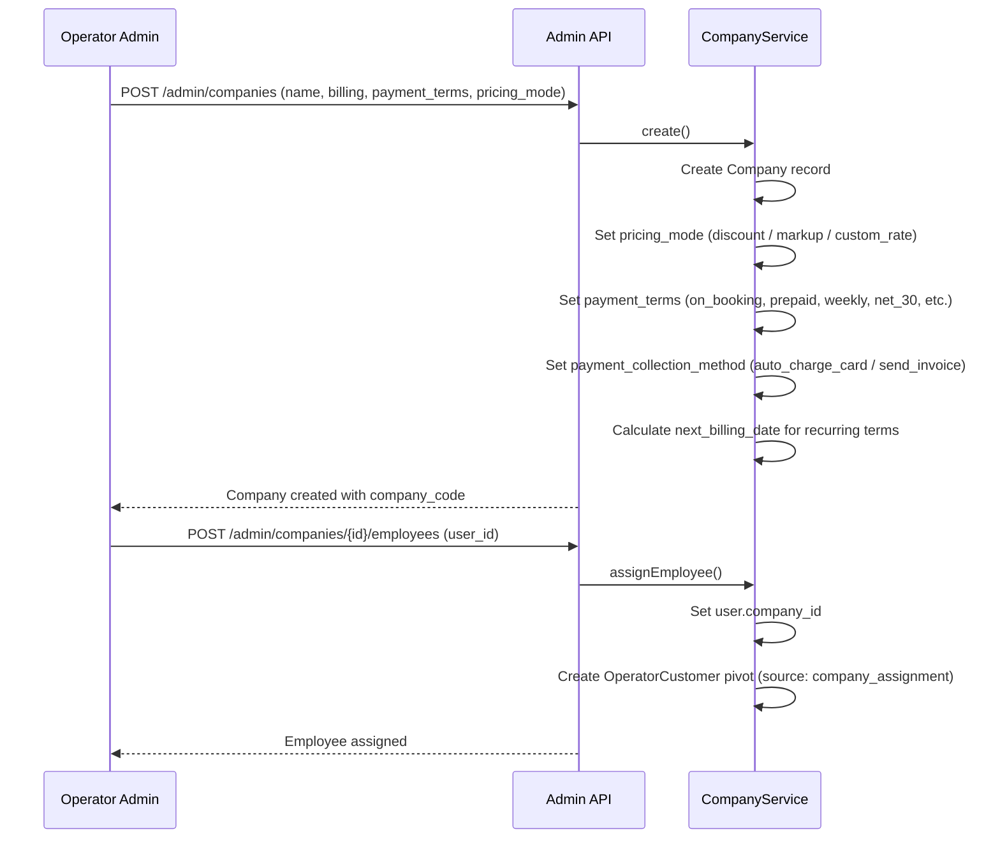
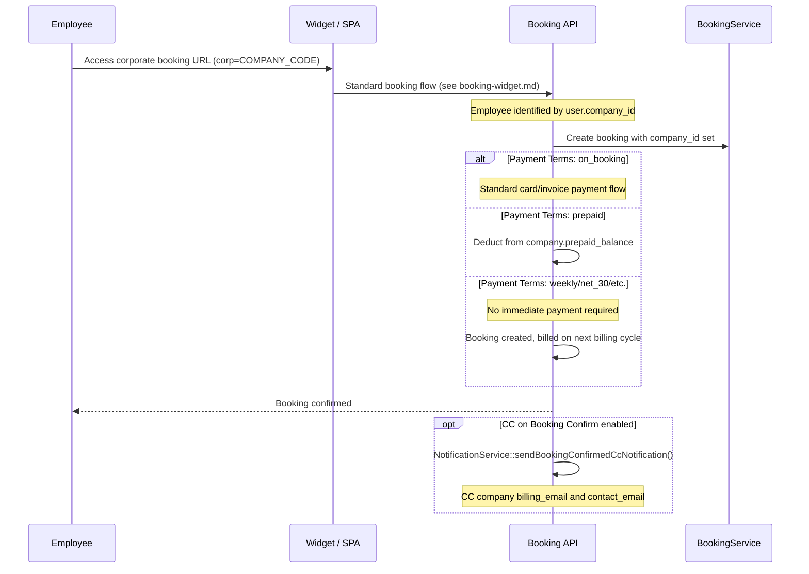
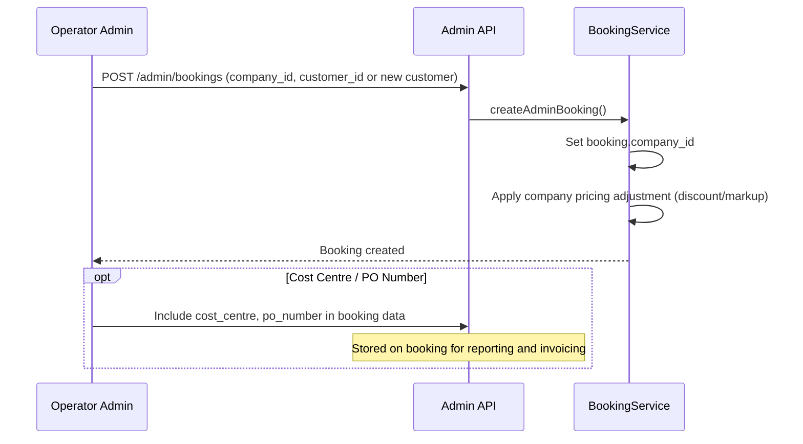
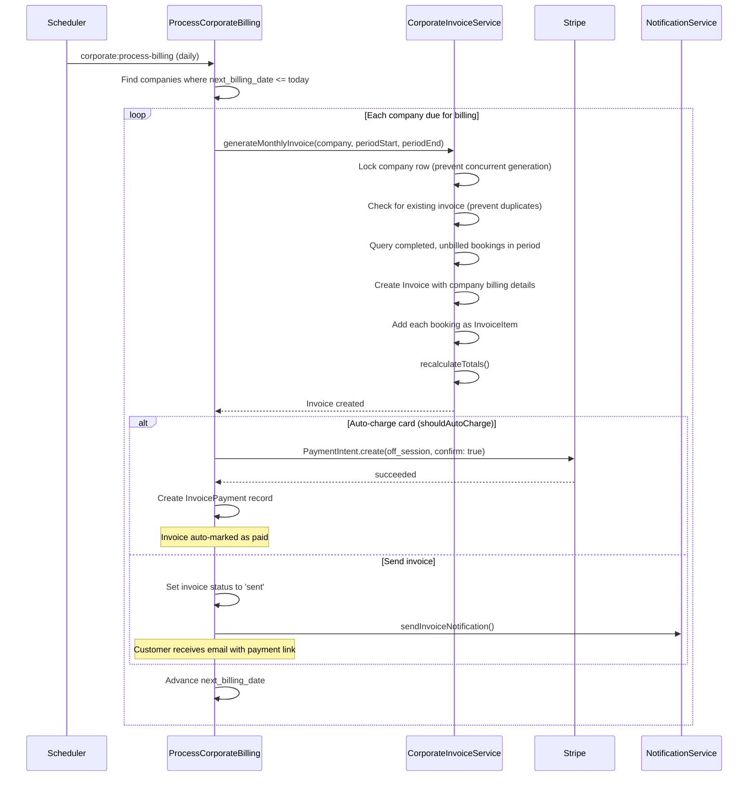

# Corporate Booking Flow

Corporate bookings made by employees or portal admins of a Company entity. Companies have configurable payment terms, pricing adjustments, cost centre tracking, and automated billing cycles.

## Actors

- **Employee** — customer with `company_id` set, books via widget or SPA
- **Portal Admin** — company user with `portal_admin_user_id`, manages employees and views reports
- **Operator Admin** — sets up companies, manages billing, approves bookings

## Entry Points

| Channel | URL | Controller |
|---------|-----|------------|
| Employee self-service (widget) | `POST /api/v1/widget/bookings` | `Widget\WidgetApiController::createBooking()` |
| Employee self-service (SPA) | `POST /api/v1/bookings` | `Api\V1\BookingController::store()` |
| Admin creates for company | `POST /api/v1/admin/bookings` | `Api\Admin\BookingController::store()` |
| Corporate booking URL | `https://bookmytransfer.net/?corp={company_code}` | Widget with corp parameter |
| Company CRUD | `POST /api/v1/admin/companies` | `Api\Admin\CompanyController` |
| Employee management | `POST /api/v1/admin/companies/{id}/employees` | `Api\Admin\CompanyController` |

## Company Setup

## Payment Terms

| Term | Value | Due Date | Billing Cycle |
|------|-------|----------|---------------|
| Pay on Booking | `on_booking` | Immediate | None |
| Prepaid Balance | `prepaid` | Immediate (from balance) | None |
| Weekly | `weekly` | 7 days | Every Monday |
| Fortnightly | `fortnightly` | 14 days | Every other Monday |
| Net 15 | `net_15` | 15 days | 15-day cycle |
| Net 30 | `net_30` | 30 days | 30-day cycle |
| Net 45 | `net_45` | 45 days | 45-day cycle |
| Net 60 | `net_60` | 60 days | 60-day cycle |

## Pricing Modes

| Mode | Value | Effect |
|------|-------|--------|
| Discount | `discount` | Reduces standard price by `pricing_percentage`% |
| Markup | `markup` | Increases standard price by `pricing_percentage`% |
| Custom Rate | `custom_rate` | Uses `pricing_percentage` as a custom multiplier |

## Payment Collection Methods

| Method | Value | Behavior |
|--------|-------|----------|
| Auto-charge card | `auto_charge_card` | Charges `stripe_payment_method_id` on billing date |
| Send invoice | `send_invoice` | Generates and emails invoice with payment link |

## Employee Self-Service Booking

## Admin Booking for Company

## Corporate Billing Cycle (Automated)

**Artisan command:** `php artisan corporate:process-billing` (runs daily via scheduler)

**Dry run:** `php artisan corporate:process-billing --dry-run`

## Commission Tracking

| Commission Type | Value | Calculation |
|-----------------|-------|-------------|
| None | `none` | No commission tracked |
| Percentage | `percentage` | `total_amount * commission_rate / 100` |
| Flat | `flat` | `commission_flat` per booking |

Commissions are tracked per booking via the `Company` model's `commission_type`, `commission_rate`, and `commission_flat` fields.

## Events Fired

| Event Type | When |
|------------|------|
| `BOOKING_CREATED` or `ADMIN_BOOKING_CREATED` | Booking saved |
| `BOOKING_CONFIRMED` | CC notification sent to company if `cc_on_booking_confirm` |
| `PAYMENT_SUCCEEDED` | Card charged (auto-charge or on-booking) |

## Key Files

| Purpose | File |
|---------|------|
| Company model | `app/Corporate/Models/Company.php` |
| Company service | `app/Corporate/Services/CompanyService.php` |
| Corporate invoice service | `app/Corporate/Services/CorporateInvoiceService.php` |
| Corporate billing command | `app/Console/Commands/ProcessCorporateBilling.php` |
| Balance transaction model | `app/Corporate/Models/BalanceTransaction.php` |
| Corporate commission model | `app/Corporate/Models/CorporateCommission.php` |
| Company controller | `app/Http/Controllers/Api/Admin/CompanyController.php` |
