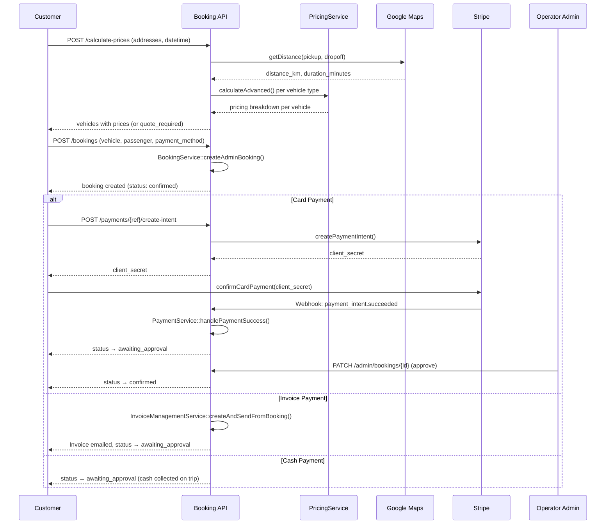
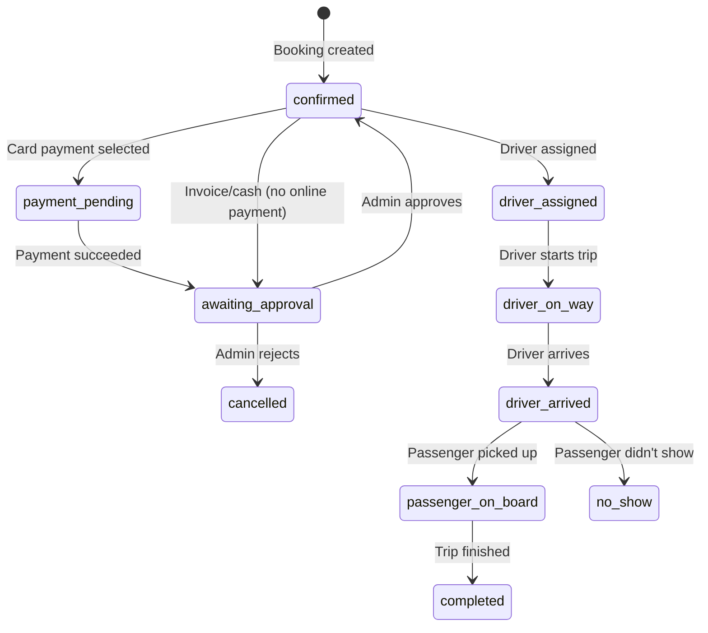

# Public Customer Booking

Direct booking by an authenticated customer through the SPA or mobile app.

## Actors

- **Customer** — authenticated user with `role=customer`
- **Operator Admin** — approves booking (if approval required)

## Entry Points

| Channel | URL | Controller |
|---------|-----|------------|
| SPA | `/bookings/create` | `Api\V1\BookingController` |
| Mobile | `POST /api/v1/bookings` | Same |
| Price check | `POST /api/v1/bookings/calculate-prices` | Same |

## Flow Diagram



## Status Progression



## Step-by-Step

### 1. Calculate Prices (optional)

```
POST /api/v1/bookings/calculate-prices
```

| Field | Required | Description |
|-------|----------|-------------|
| `pickup_address` | Yes | Full address string |
| `pickup_latitude` | Yes | Decimal |
| `pickup_longitude` | Yes | Decimal |
| `dropoff_address` | Yes | Full address string |
| `dropoff_latitude` | Yes | Decimal |
| `dropoff_longitude` | Yes | Decimal |
| `service_type` | Yes | `point_to_point`, `airport_transfer`, `hourly`, `wedding` |
| `pickup_datetime` | Yes | ISO 8601 |
| `passenger_count` | Yes | 1-50 |

**Process:**
1. `GoogleMapsService::getDistance()` → distance_km, duration_minutes
2. For each active VehicleType: `PricingService::calculateAdvanced()` → pricing breakdown
3. Returns array of vehicles with `total`, `breakdown`, or `quote_required: true`

### 2. Create Booking

```
POST /api/v1/bookings
```

**Additional fields:** `vehicle_type_id`, `payment_method` (card/invoice/cash), `luggage_large`, `luggage_small`, `special_requirements`, `flight_number`

**Service:** `BookingService::createAdminBooking($data, $user)`

**Sets:** `booking_source = 'customer'`, initial status based on payment method

### 3. Payment (if card)

```
POST /api/v1/payments/{reference}/create-intent
→ Returns client_secret
→ Frontend confirms with Stripe.js
POST /api/v1/payments/{reference}/confirm
→ Or handled by Stripe webhook
```

### 4. Admin Approval

```
PATCH /api/v1/admin/bookings/{id}  (action: approve)
```

## Events Fired

| Event | When | Listeners |
|-------|------|-----------|
| `BookingCreated` | Booking saved | `LogBookingEvent`, `SendBookingConfirmation` |
| `PaymentSucceeded` | Stripe confirms | `SendPaymentConfirmation` |
| `BookingConfirmed` | Admin approves | `SendBookingConfirmedNotification` |

## Key Files

| Purpose | File |
|---------|------|
| Controller | `app/Http/Controllers/Api/V1/BookingController.php` |
| Service | `app/Booking/Services/BookingService.php` |
| Pricing | `app/Pricing/Services/PricingService.php` |
| Payment | `app/Payment/Services/PaymentService.php` |
| Events | `app/Booking/Events/BookingCreated.php` |
