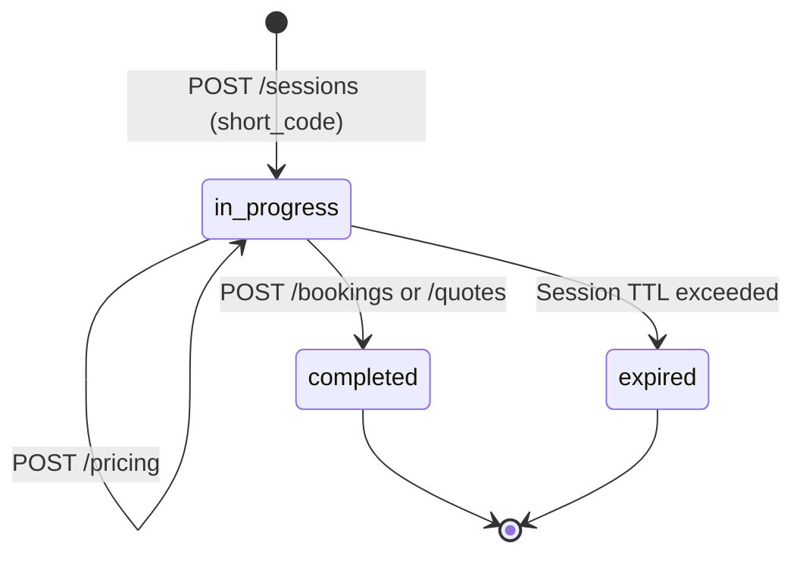
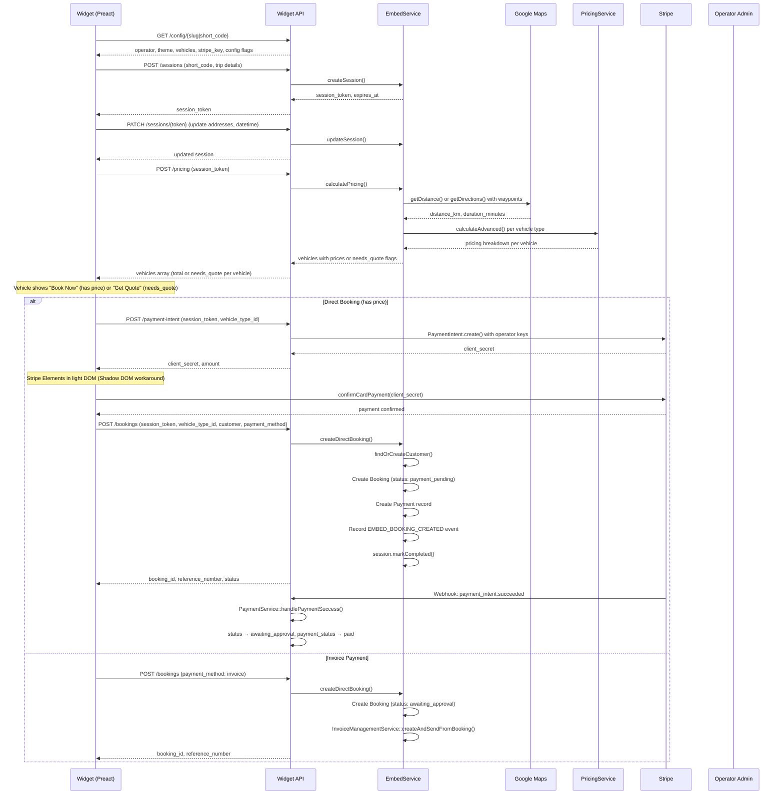
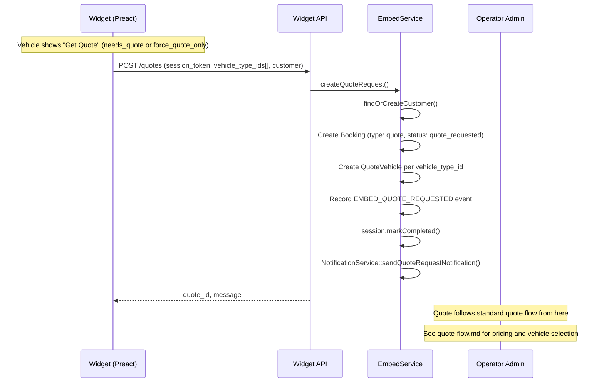
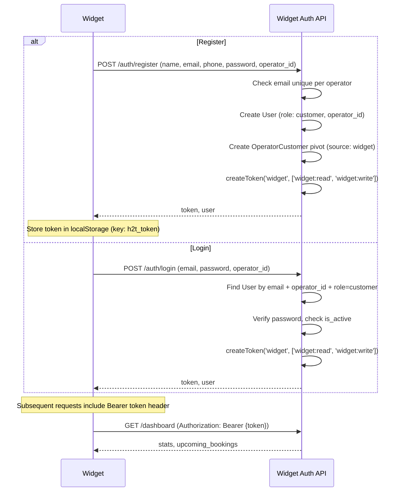

# Widget/Embed Booking Flow

Booking or quote request submitted through the Preact micro-frontend widget or legacy Blade embed widgets, embedded on third-party websites via `<here2there-booking>` custom element.

## Actors

- **Visitor** — unauthenticated user on a third-party website
- **Authenticated Customer** — logged-in widget user (optional)
- **Operator Admin** — receives quote requests, approves bookings

## Entry Points

| Channel | URL | Controller |
|---------|-----|------------|
| Widget config | `GET /api/v1/widget/config/{identifier}` | `Widget\WidgetApiController::config()` |
| Create session | `POST /api/v1/widget/sessions` | `Widget\WidgetApiController::createSession()` |
| Update session | `PATCH /api/v1/widget/sessions/{token}` | `Widget\WidgetApiController::updateSession()` |
| Calculate pricing | `POST /api/v1/widget/pricing` | `Widget\WidgetApiController::pricing()` |
| Create booking | `POST /api/v1/widget/bookings` | `Widget\WidgetApiController::createBooking()` |
| Create quote | `POST /api/v1/widget/quotes` | `Widget\WidgetApiController::createQuote()` |
| Create PaymentIntent | `POST /api/v1/widget/payment-intent` | `Widget\WidgetApiController::createPaymentIntent()` |
| Validate promo | `POST /api/v1/widget/promo-code/validate` | `Widget\WidgetApiController::validatePromoCode()` |
| Login | `POST /api/v1/widget/auth/login` | `Widget\WidgetAuthController::login()` |
| Register | `POST /api/v1/widget/auth/register` | `Widget\WidgetAuthController::register()` |
| Dashboard | `GET /api/v1/widget/dashboard` | `Widget\WidgetDashboardController::index()` |
| Saved cards | `GET /api/v1/widget/saved-cards` | `Widget\WidgetSavedCardController::index()` |

## Session Lifecycle

## Flow Diagram — Direct Booking Path

## Flow Diagram — Quote Path

## Widget Auth (Login/Register within Widget)

## Stripe Elements in Shadow DOM

Stripe Elements cannot mount inside Shadow DOM. The widget uses a **light DOM slot pattern**:

1. Widget creates `
` in the **host element's light DOM**
2. Shadow DOM template contains `<slot name="stripe-card-xxx" />`
3. Stripe Elements mount on the light DOM container
4. Browser projects the element into the shadow DOM slot visually
5. On unmount: remove light DOM element + `cardElement.destroy()`

## Hybrid Mode

Each vehicle independently shows **"Book Now"** or **"Get Quote"** based on pricing availability:

- `total > 0` and `needs_quote: false` — "Book Now" (direct booking path)
- `needs_quote: true` — "Get Quote" (quote path)
- `force_quote_only: true` on config — all vehicles forced to quote path

## Widget Versions

| Version | Technology | `widget_version` value |
|---------|-----------|----------------------|
| Blade V1 | Alpine.js + Tailwind (iframe) | `blade_v1` |
| Blade V2 | Alpine.js + Tailwind (iframe) | `blade_v2` |
| Preact V1 | Preact web component (Shadow DOM) | `preact_v1` |

All versions share `EmbedService` for backend logic.

## Rate Limiting

| Tier | Limit | Scope |
|------|-------|-------|
| `widget-config` | 120/min | Config lookups |
| `widget-session` | 30/min | Session operations |
| `widget-submit` | 5/min | Booking/quote submissions |

## CORS

`WidgetCors` middleware registered as **global middleware before HandleCors** in Kernel.php. Only affects `api/v1/widget/*` routes. Route middleware alone does not work because Laravel's global `HandleCors` intercepts OPTIONS preflight before route middleware runs.

## Events Fired

| Event Type | When |
|------------|------|
| `EMBED_BOOKING_CREATED` | Direct booking saved |
| `EMBED_QUOTE_REQUESTED` | Quote request saved |
| `PAYMENT_SUCCEEDED` | Stripe webhook confirms card payment |

## Key Files

| Purpose | File |
|---------|------|
| Widget API controller | `app/Http/Controllers/Api/V1/Widget/WidgetApiController.php` |
| Widget auth controller | `app/Http/Controllers/Api/V1/Widget/WidgetAuthController.php` |
| Widget dashboard controller | `app/Http/Controllers/Api/V1/Widget/WidgetDashboardController.php` |
| Widget saved cards controller | `app/Http/Controllers/Api/V1/Widget/WidgetSavedCardController.php` |
| Embed service | `app/Embed/Services/EmbedService.php` |
| Widget provisioning | `app/Embed/Services/WidgetProvisioningService.php` |
| Embed session model | `app/Embed/Models/EmbedSession.php` |
| Embed config model | `app/Embed/Models/EmbedConfiguration.php` |
| CORS middleware | `app/Http/Middleware/WidgetCors.php` |
| Preact widget source | `widget/` |
