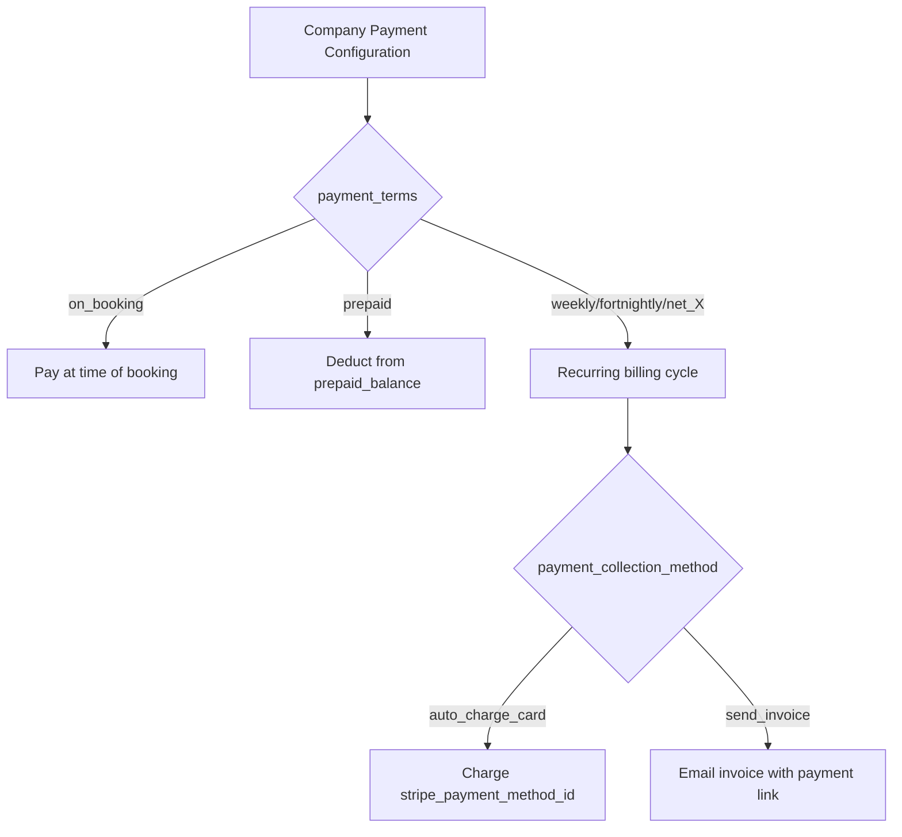
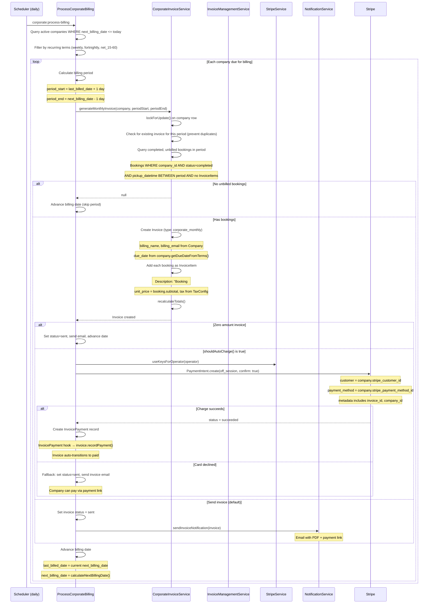
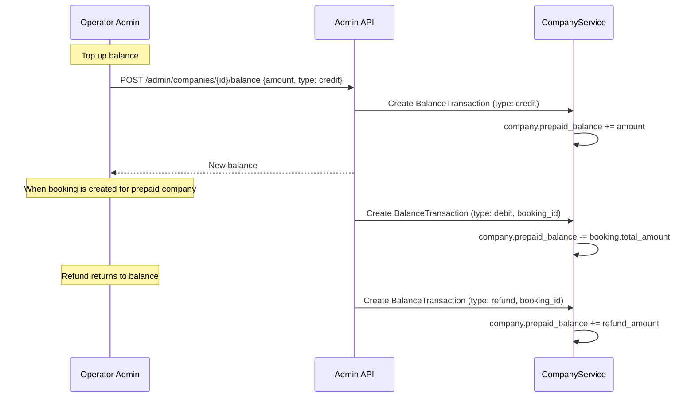
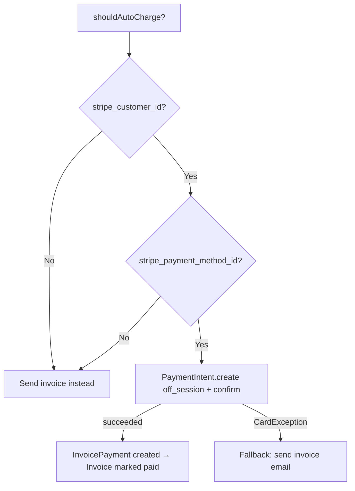

# Corporate Billing Flow

Automated billing cycles for corporate companies, including prepaid balance management, auto-charge card, monthly invoice generation, commission tracking, and low balance alerts.

## Actors

- **System** — runs billing cycle daily via scheduler
- **Operator Admin** — configures companies, manages balances, views commissions
- **Company Portal Admin** — views invoices, manages payment methods

## Entry Points

| Channel | URL / Command | Handler |
|---------|--------------|---------|
| Process billing | `php artisan corporate:process-billing` | `ProcessCorporateBilling` command |
| Dry run | `php artisan corporate:process-billing --dry-run` | Same (preview mode) |
| Company settings | `PATCH /api/v1/admin/companies/{id}` | `Api\Admin\CompanyController::update()` |
| Balance top-up | `POST /api/v1/admin/companies/{id}/balance` | `Api\Admin\CompanyController::topUp()` |

## Payment Terms and Collection Methods

## Automated Billing Cycle

## Billing Period Calculation

| Payment Terms | Period Length | Next Billing Date |
|--------------|-------------|-------------------|
| `weekly` | 7 days | Next Monday |
| `fortnightly` | 14 days | Monday + 1 week |
| `net_15` | 15 days | +15 days |
| `net_30` | 30 days | +30 days |
| `net_45` | 45 days | +45 days |
| `net_60` | 60 days | +60 days |

## Prepaid Balance Flow

## Auto-Charge Card Flow

Requires:
- `payment_collection_method = 'auto_charge_card'`
- `stripe_customer_id` is set
- `stripe_payment_method_id` is set

## Commission Tracking

Each Company has optional commission tracking:

| Field | Description |
|-------|-------------|
| `commission_type` | `none`, `percentage`, `flat` |
| `commission_rate` | Percentage rate (e.g., 15.00 for 15%) |
| `commission_flat` | Flat amount per booking |

Commission is tracked per booking via the `CorporateCommission` model and appears on reports.

## Low Balance Alerts

When `prepaid_balance` drops below `low_balance_threshold`:
- Alert sent to company portal admin
- Alert sent to operator admin
- Tracked via `BalanceTransaction` history

## Due Date Calculation

`Company::getDueDateFromTerms()` maps payment terms to due dates:

| Term | Days Added |
|------|-----------|
| `on_booking` | 0 |
| `prepaid` | 0 |
| `weekly` | 7 |
| `fortnightly` | 14 |
| `net_15` | 15 |
| `net_30` | 30 |
| `net_45` | 45 |
| `net_60` | 60 |

## Key Files

| Purpose | File |
|---------|------|
| Billing command | `app/Console/Commands/ProcessCorporateBilling.php` |
| Corporate invoice service | `app/Corporate/Services/CorporateInvoiceService.php` |
| Company service | `app/Corporate/Services/CompanyService.php` |
| Company model | `app/Corporate/Models/Company.php` |
| Balance transaction model | `app/Corporate/Models/BalanceTransaction.php` |
| Corporate commission model | `app/Corporate/Models/CorporateCommission.php` |
| Invoice management service | `app/Payment/Services/InvoiceManagementService.php` |
| Stripe service | `app/Services/External/StripeService.php` |
