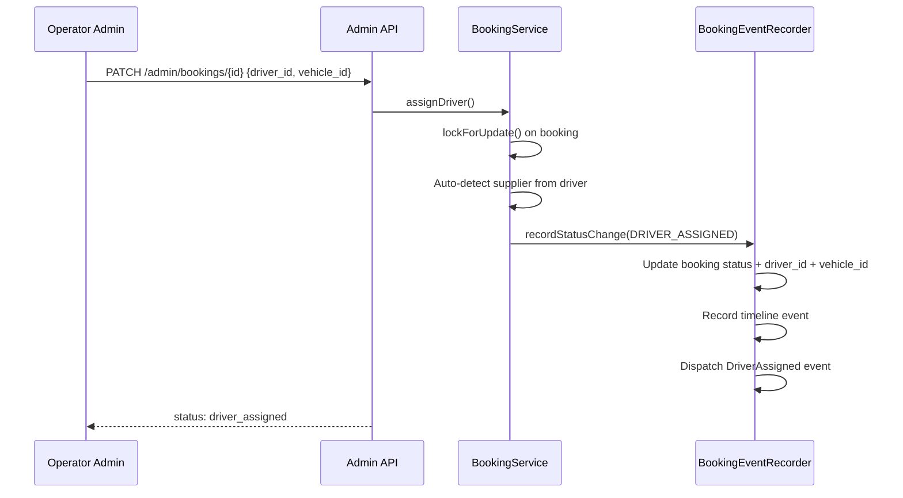
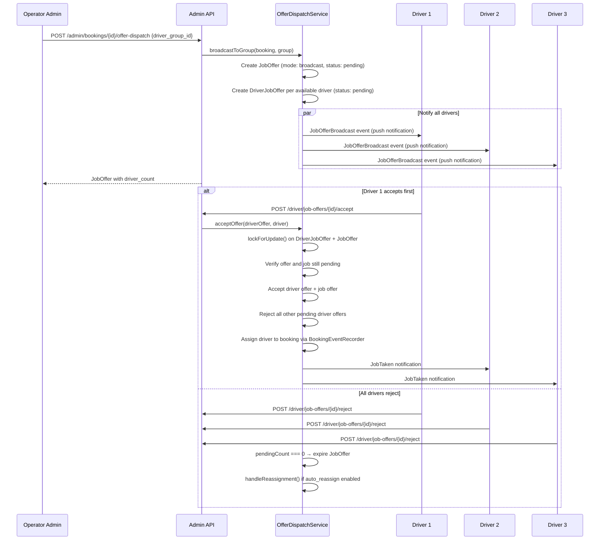
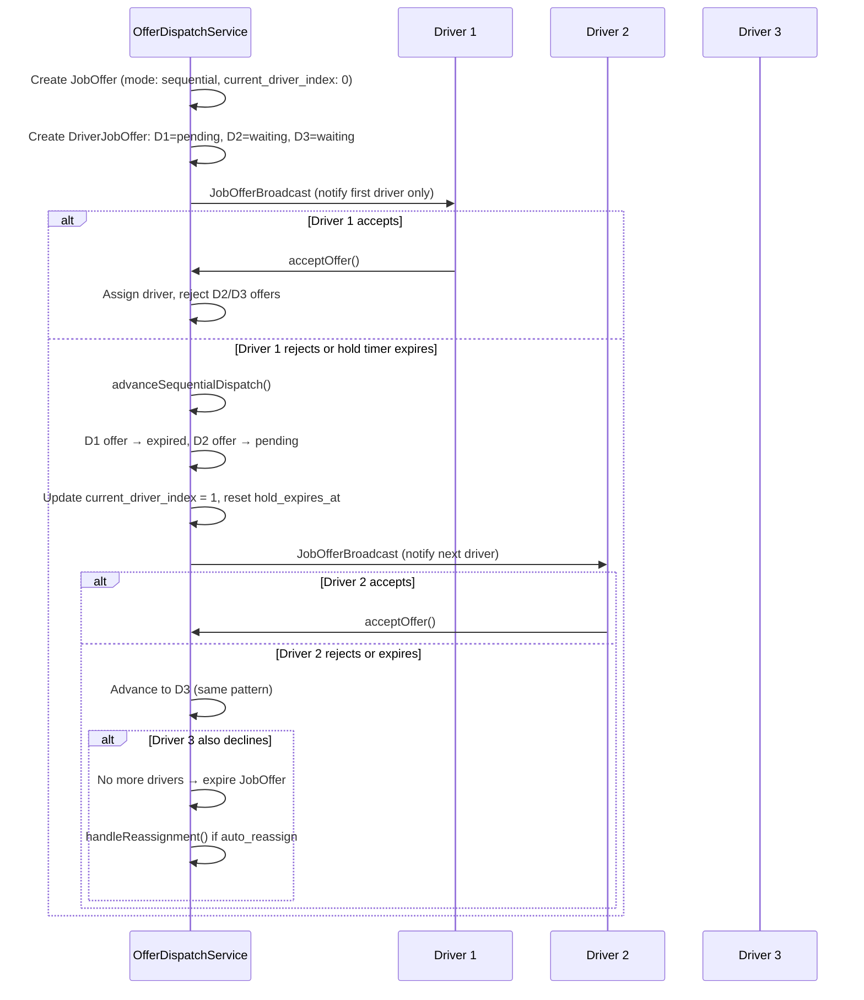
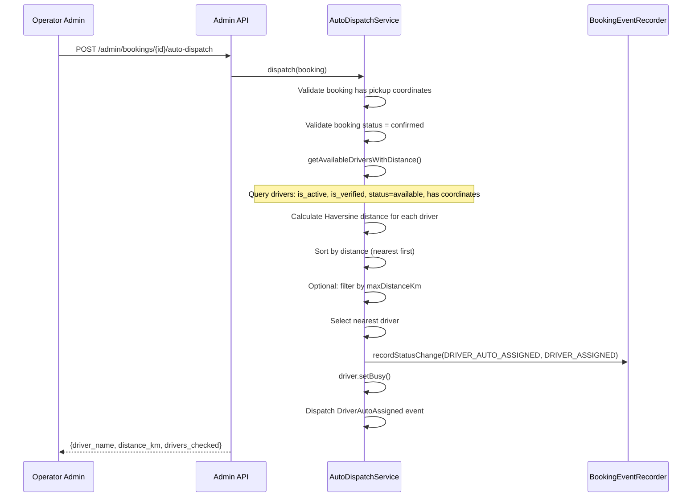
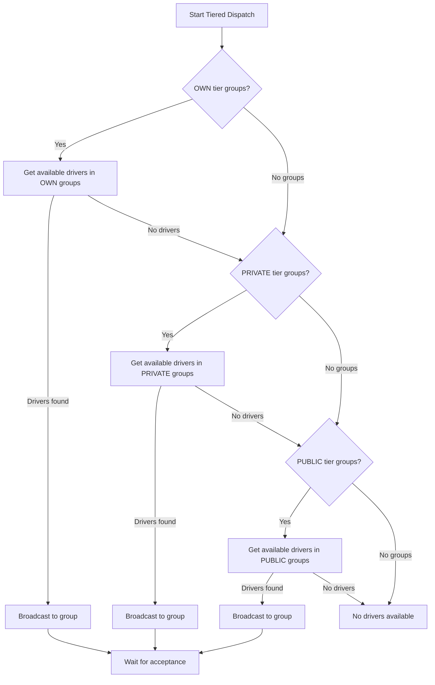
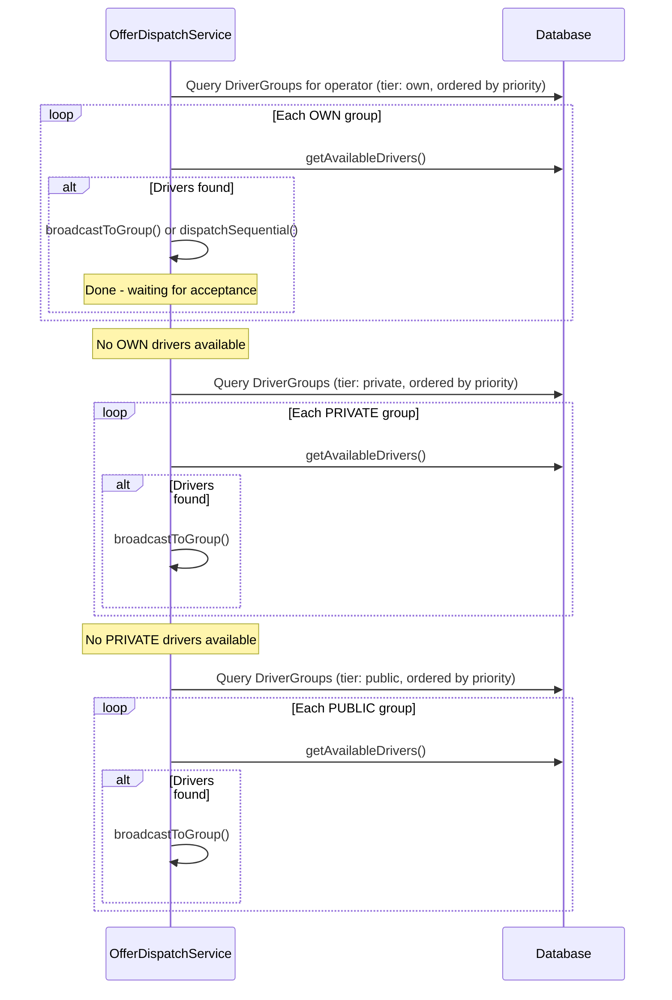
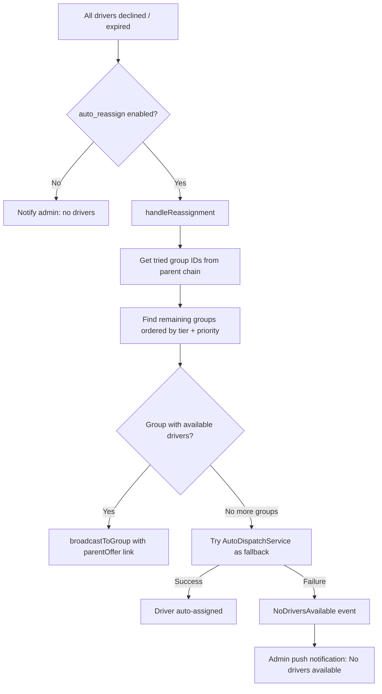

# Dispatch Flow

All dispatch modes for assigning drivers to bookings. Supports manual assignment, offer broadcast, sequential (hold timer), auto-dispatch (nearest driver), and tiered cascade (OWN -> PRIVATE -> PUBLIC).

## Actors

- **Operator Admin** — initiates dispatch, manually assigns drivers
- **Driver** — receives offers, accepts/rejects
- **System** — auto-dispatch, offer expiry, reassignment

## Entry Points

| Channel | URL | Controller |
|---------|-----|------------|
| Manual assign | `PATCH /api/v1/admin/bookings/{id}` | `Api\Admin\BookingController::update()` |
| Offer broadcast | `POST /api/v1/admin/bookings/{id}/offer-dispatch` | `Api\Admin\BookingController::offerDispatch()` |
| Auto dispatch | `POST /api/v1/admin/bookings/{id}/auto-dispatch` | `Api\Admin\BookingController::autoDispatch()` |
| Accept offer | `POST /api/v1/driver/job-offers/{id}/accept` | `Api\Driver\JobOfferController::accept()` |
| Reject offer | `POST /api/v1/driver/job-offers/{id}/reject` | `Api\Driver\JobOfferController::reject()` |
| Expire offers | Scheduled command | `ExpireJobOffers` job |

## Dispatch Mode Overview

| Mode | When | How |
|------|------|-----|
| **Manual** | Admin picks a driver | Direct assignment, no offers |
| **Broadcast** | Pre-scheduled bookings | All drivers in group notified simultaneously |
| **Sequential** | ASAP bookings | One driver at a time with hold timer |
| **Auto** | Nearest driver needed | System finds and assigns nearest available |
| **Tiered** | Cascade through groups | OWN -> PRIVATE -> PUBLIC tiers in order |
| **Smart** | Auto-selects mode | Sequential for ASAP, broadcast for scheduled |

---

## 1. Manual Assignment

---

## 2. Offer Broadcast (to Group)

All drivers in the group receive the offer simultaneously. First to accept wins.

---

## 3. Sequential Dispatch (Hold Timer)

Offers to one driver at a time. If the hold timer expires or driver rejects, advances to next.

**Hold timer:** Configured per driver group via `hold_timer_minutes` (default: 2 minutes).

**Offer timeout:** Configured per group via `offer_timeout_minutes` (default: 5 minutes).

---

## 4. Auto Dispatch (Nearest Driver)

System finds the nearest available driver using Haversine distance calculation and assigns directly.

**Driver availability criteria:**
- `is_active = true`
- `is_verified = true`
- `status = 'available'`
- `current_latitude` and `current_longitude` not null

---

## 5. Tiered Dispatch (OWN -> PRIVATE -> PUBLIC)

Three-tier cascade through driver groups ordered by tier and priority.

**Tier enum values:** `own` (order 1), `private` (order 2), `public` (order 3)

Groups within each tier are ordered by `priority ASC`.

---

## 6. Reassignment Cascade

When all drivers in a group decline (or offers expire), the system automatically tries the next group.

**Parent chain:** Job offers link via `parent_job_offer_id` to track which groups have already been tried.

## Smart Dispatch

`smartDispatch()` auto-selects the dispatch mode:
- **ASAP bookings** (pickup within ~1 hour): sequential dispatch (hold timer)
- **Scheduled bookings**: broadcast to group

## Driver Group Model

| Field | Description |
|-------|-------------|
| `name` | Group name |
| `tier` | `own`, `private`, `public` |
| `priority` | Sort order within tier (lower = tried first) |
| `offer_timeout_minutes` | How long the overall offer stays open (default: 5) |
| `hold_timer_minutes` | Per-driver hold time in sequential mode (default: 2) |
| `is_shared` | Whether this group is shared across operators |
| `is_active` | Whether this group is available for dispatch |

## Events Fired

| Event | When | Listeners |
|-------|------|-----------|
| `JobOfferBroadcast` | Offer sent to a driver | `SendJobOfferToDrivers` (push notification) |
| `JobOfferAccepted` | Driver accepts an offer | `SendJobAcceptedConfirmation` |
| `JobOfferCancelled` | Admin cancels an offer | `SendJobOfferCancelledNotification` |
| `DriverAssigned` | Driver assigned to booking | `SendDriverAssignedNotification` |
| `DriverAutoAssigned` | Auto-dispatch assigns driver | Notification to customer and driver |
| `NoDriversAvailable` | All dispatch options exhausted | `SendAdminNoDriversNotification` |

## Key Files

| Purpose | File |
|---------|------|
| Offer dispatch service | `app/Dispatch/Services/OfferDispatchService.php` |
| Auto dispatch service | `app/Dispatch/Services/AutoDispatchService.php` |
| Driver job service | `app/Dispatch/Services/DriverJobService.php` |
| Dispatch tier enum | `app/Dispatch/Enums/DispatchTier.php` |
| JobOffer model | `app/Dispatch/Models/JobOffer.php` |
| DriverJobOffer model | `app/Dispatch/Models/DriverJobOffer.php` |
| DriverGroup model | `app/Driver/Models/DriverGroup.php` |
| Expire offers job | `app/Dispatch/Jobs/ExpireJobOffers.php` |
| Events | `app/Dispatch/Events/` |
| Listeners | `app/Dispatch/Listeners/` |
