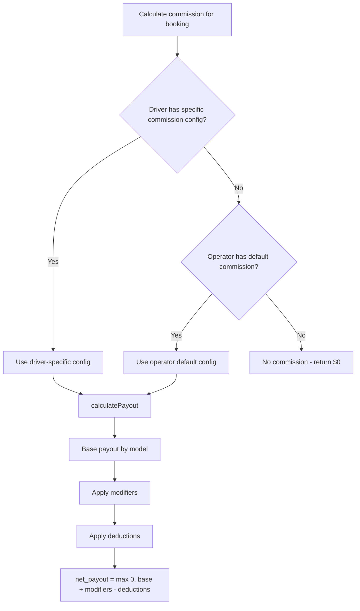
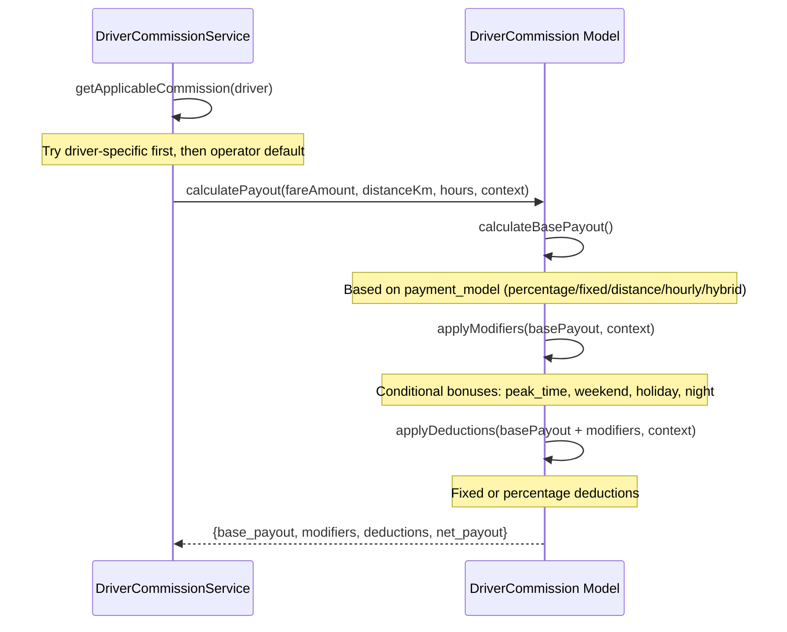
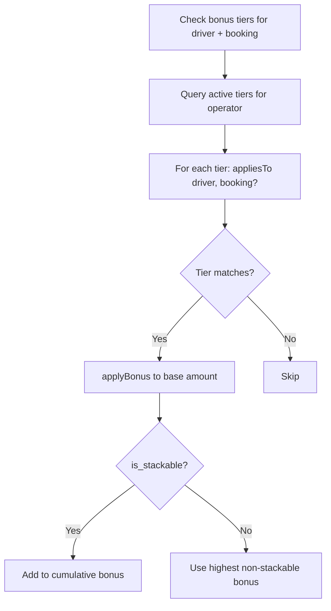
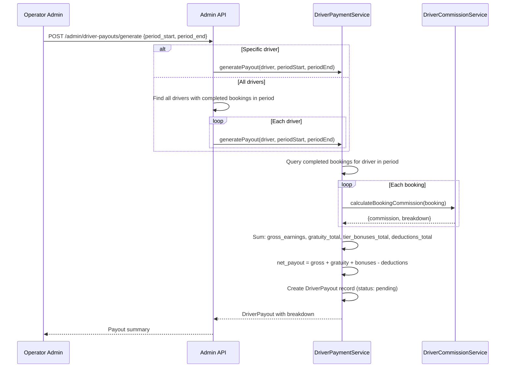
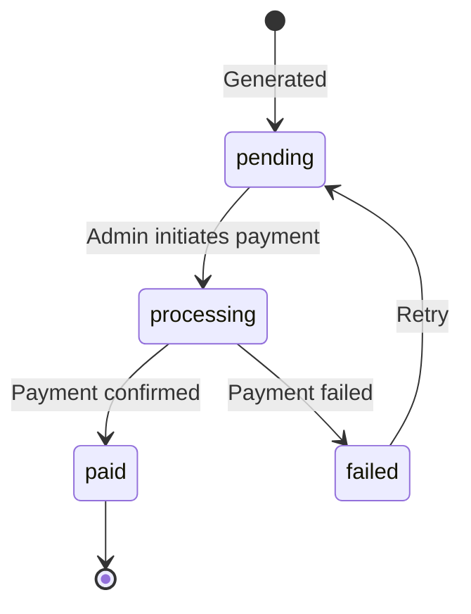
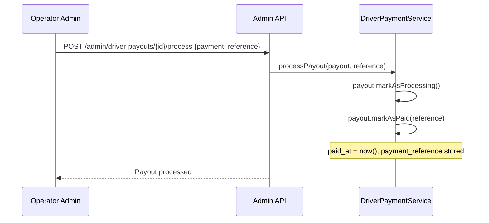

# Driver Earnings Flow

Commission calculation, bonus tiers, deductions, and payout generation for drivers.

## Actors

- **Operator Admin** — configures commissions, generates payouts, processes payments
- **Driver** — views earnings summary in portal/app

## Entry Points

| Channel | URL | Controller |
|---------|-----|------------|
| List commissions | `GET /api/v1/admin/driver-commissions` | `Api\Admin\DriverCommissionController::index()` |
| Create commission | `POST /api/v1/admin/driver-commissions` | `Api\Admin\DriverCommissionController::store()` |
| List payouts | `GET /api/v1/admin/driver-payouts` | `Api\Admin\DriverPayoutController::index()` |
| Generate payouts | `POST /api/v1/admin/driver-payouts/generate` | `Api\Admin\DriverPayoutController::generate()` |
| Process payout | `POST /api/v1/admin/driver-payouts/{id}/process` | `Api\Admin\DriverPayoutController::process()` |
| Booking earnings preview | `GET /api/v1/admin/driver-payouts/booking/{id}` | `Api\Admin\DriverPayoutController::calculateBookingEarnings()` |
| Driver summary | `GET /api/v1/admin/driver-payouts/driver/{id}/summary` | `Api\Admin\DriverPayoutController::driverSummary()` |
| Driver earnings (portal) | `GET /api/v1/driver/earnings` | `Api\Driver\EarningsController` |

## Commission Models

| Model | Constant | Calculation |
|-------|----------|-------------|
| Percentage | `percentage` | `fare * (percentage / 100)` |
| Fixed | `fixed` | `base_amount` per job |
| Distance | `distance` | `base_amount + (distance_km * per_km_rate)` |
| Hourly | `hourly` | `base_amount + (hours * per_hour_rate)` |
| Hybrid | `hybrid` | `base_amount + fare_percentage + distance_component + hourly_component` |

## Commission Resolution

## Calculation Flow

## Modifiers (Conditional Bonuses)

Modifiers are stored as JSON array on the `DriverCommission` model. Each modifier has:

| Field | Description |
|-------|-------------|
| `type` | `percentage` or `fixed` |
| `value` | Amount or percentage |
| `condition` | When to apply: `peak_time`, `weekend`, `holiday`, `night` |

Example modifier: `{"type": "percentage", "value": 20, "condition": "weekend"}` adds 20% to base payout on weekends.

Modifier applies when the matching context flag is true (e.g., `context['is_weekend'] = true`).

## Deductions

Deductions are stored as JSON array. Each deduction has:

| Field | Description |
|-------|-------------|
| `type` | `percentage` or `fixed` |
| `value` | Amount or percentage to deduct |

Example: `{"type": "fixed", "value": 5}` deducts $5 per job (e.g., for vehicle rental, platform fee).

## Bonus Tiers

Bonus tiers (`DriverCommissionTier`) are operator-wide rules that apply additional bonuses based on driver/booking attributes.

| Trigger Type | Constant | Config | Example |
|-------------|----------|--------|---------|
| Tenure | `tenure` | `{min_months: 12}` | Drivers with 12+ months tenure |
| Rating | `rating` | `{min_rating: 4.5}` | Drivers with 4.5+ rating |
| Service Type | `service_type` | `{service_types: ["wedding"]}` | Wedding bookings |
| Vehicle Type | `vehicle_type` | `{vehicle_type_ids: [1,2]}` | Specific vehicle types |
| Time of Day | `time_of_day` | `{start_hour: 22, end_hour: 6}` | Night shifts (handles overnight) |
| Monthly Volume | `monthly_volume` | `{min_jobs: 50}` | 50+ jobs this month |

Each tier has:
- `bonus_type`: `percentage` or `fixed`
- `bonus_value`: amount or percentage
- `is_stackable`: whether multiple tiers can stack
- `priority`: evaluation order

## Payment Frequency

| Frequency | Constant | Description |
|-----------|----------|-------------|
| Per Job | `per_job` | Paid immediately after each job |
| Daily | `daily` | Daily payout summary |
| Weekly | `weekly` | Weekly payout (default) |
| Fortnightly | `fortnightly` | Every 2 weeks |
| Monthly | `monthly` | Monthly payout |

## Payout Generation

## Payout Processing

## DriverPayout Model

| Field | Type | Description |
|-------|------|-------------|
| `driver_id` | FK | Driver receiving payout |
| `operator_id` | FK | Operator scoping |
| `period_start` | date | Start of earnings period |
| `period_end` | date | End of earnings period |
| `gross_earnings` | decimal | Sum of base commission amounts |
| `gratuity_total` | decimal | Total tips |
| `tier_bonuses_total` | decimal | Total from bonus tiers |
| `deductions_total` | decimal | Total deductions |
| `net_payout` | decimal | Final payout amount |
| `status` | string | `pending`, `processing`, `paid`, `failed` |
| `payment_reference` | string | External payment reference (bank transfer, etc.) |
| `breakdown` | JSON | Detailed per-booking breakdown |
| `paid_at` | datetime | When payout was completed |

## Key Files

| Purpose | File |
|---------|------|
| Commission service | `app/Driver/Services/DriverCommissionService.php` |
| Payment service | `app/Driver/Services/DriverPaymentService.php` |
| Commission model | `app/Driver/Models/DriverCommission.php` |
| Commission tier model | `app/Driver/Models/DriverCommissionTier.php` |
| Payout model | `app/Driver/Models/DriverPayout.php` |
| Commission controller | `app/Http/Controllers/Api/Admin/DriverCommissionController.php` |
| Payout controller | `app/Http/Controllers/Api/Admin/DriverPayoutController.php` |
| Performance service | `app/Driver/Services/DriverPerformanceService.php` |
