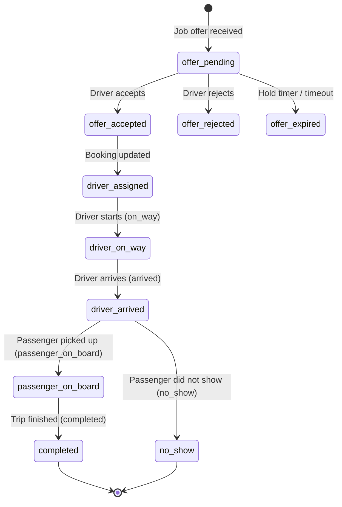
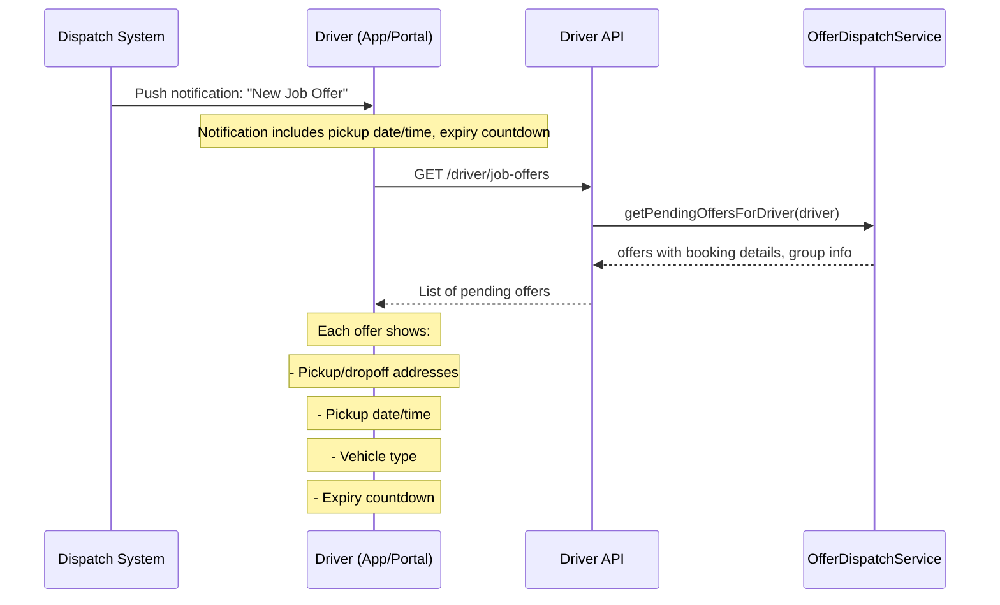
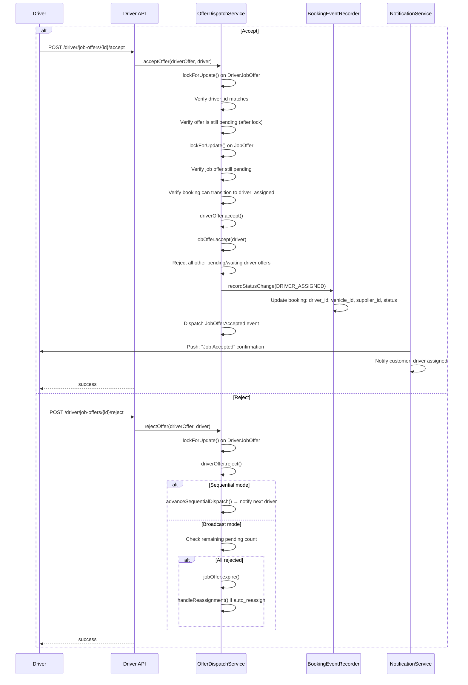
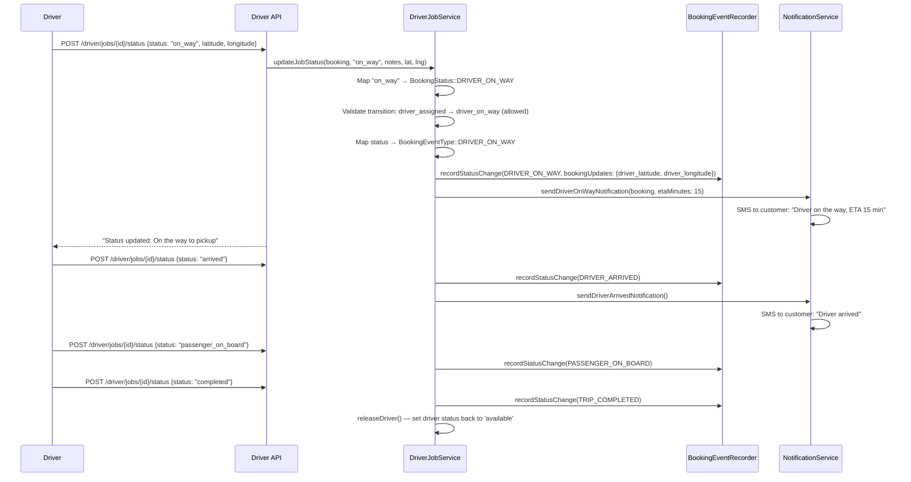
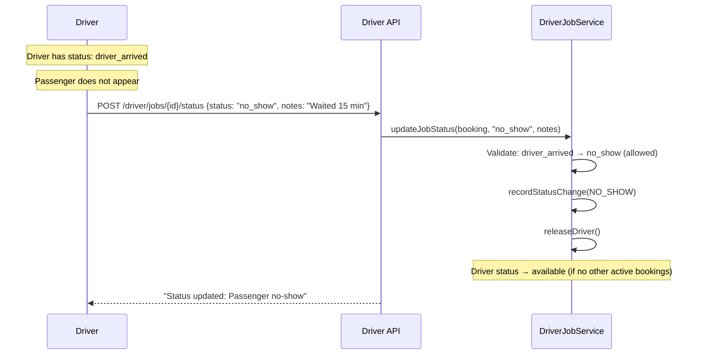
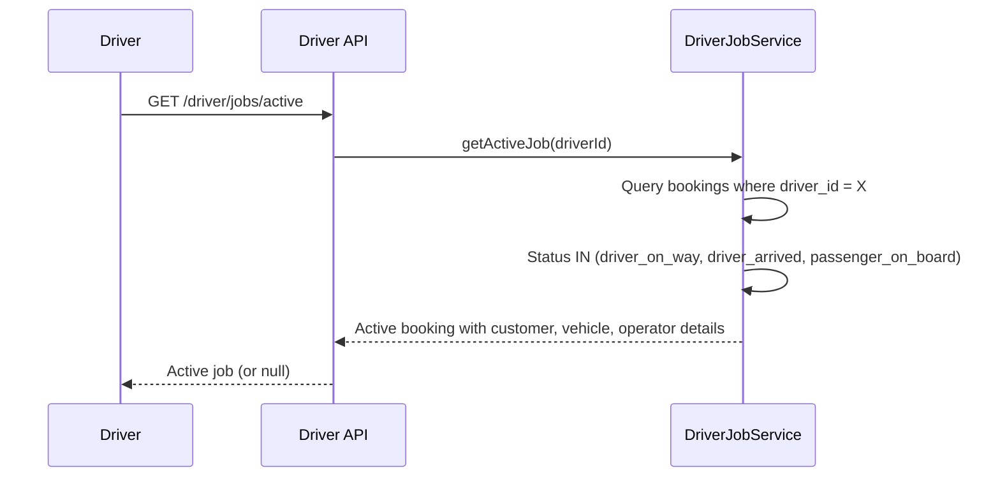

# Driver Job Lifecycle

Complete lifecycle of a driver's interaction with a booking, from receiving an offer to completing a trip.

## Actors

- **Driver** — receives offers, updates trip status
- **Customer** — receives status notifications
- **System** — manages offer expiry, releases driver status

## Entry Points

| Channel | URL | Controller |
|---------|-----|------------|
| Pending offers | `GET /api/v1/driver/job-offers` | `Api\Driver\JobOfferController::index()` |
| Accept offer | `POST /api/v1/driver/job-offers/{id}/accept` | `Api\Driver\JobOfferController::accept()` |
| Reject offer | `POST /api/v1/driver/job-offers/{id}/reject` | `Api\Driver\JobOfferController::reject()` |
| Today's jobs | `GET /api/v1/driver/jobs/today` | `Api\Driver\JobController::today()` |
| Active job | `GET /api/v1/driver/jobs/active` | `Api\Driver\JobController::active()` |
| Update status | `POST /api/v1/driver/jobs/{id}/status` | `Api\Driver\JobController::updateStatus()` |
| Job detail | `GET /api/v1/driver/jobs/{id}` | `Api\Driver\JobController::show()` |

## Full Job Lifecycle

## Receiving and Viewing Offers

## Accept / Reject Flow

## Status Updates (Trip Progress)

## Allowed Status Transitions

| Current Status | Allowed Next Status |
|---------------|-------------------|
| `driver_assigned` | `driver_on_way`, `cancelled` |
| `driver_on_way` | `driver_arrived`, `cancelled` |
| `driver_arrived` | `passenger_on_board`, `no_show`, `cancelled` |
| `passenger_on_board` | `completed` |

## Status Input Mapping

The driver API accepts short status names that map to `BookingStatus` enum values:

| Driver Input | BookingStatus | BookingEventType |
|-------------|---------------|-----------------|
| `on_way` | `DRIVER_ON_WAY` | `DRIVER_ON_WAY` |
| `arrived` | `DRIVER_ARRIVED` | `DRIVER_ARRIVED` |
| `passenger_on_board` | `PASSENGER_ON_BOARD` | `PASSENGER_ON_BOARD` |
| `completed` | `COMPLETED` | `TRIP_COMPLETED` |
| `no_show` | `NO_SHOW` | `NO_SHOW` |

## No-Show Handling

## Active Job Tracking

## Driver Release Logic

On terminal statuses (`completed`, `no_show`):

1. Lock driver row (`lockForUpdate`)
2. Check if driver has other active bookings (`driver_assigned`, `driver_on_way`, `driver_arrived`, `passenger_on_board`)
3. If no other active bookings: set `driver.status = 'available'`
4. If other active bookings remain: keep `driver.status = 'busy'`

## Customer Notifications Per Status

| Status | Email | SMS | Push |
|--------|-------|-----|------|
| `driver_assigned` | Yes | Yes | Yes |
| `driver_on_way` | No | Yes (with ETA) | No |
| `driver_arrived` | No | Yes | No |
| `passenger_on_board` | No | No | No |
| `completed` | No | No | No |
| `no_show` | No | No | No |

## Events Fired

| Event Type | When |
|------------|------|
| `DRIVER_ON_WAY` | Driver starts heading to pickup |
| `DRIVER_ARRIVED` | Driver reaches pickup location |
| `PASSENGER_ON_BOARD` | Passenger picked up, trip starts |
| `TRIP_COMPLETED` | Trip finished successfully |
| `NO_SHOW` | Passenger did not show up |

## Key Files

| Purpose | File |
|---------|------|
| Driver job service | `app/Dispatch/Services/DriverJobService.php` |
| Offer dispatch service | `app/Dispatch/Services/OfferDispatchService.php` |
| Job offer controller (driver) | `app/Http/Controllers/Api/Driver/JobOfferController.php` |
| Job controller (driver) | `app/Http/Controllers/Api/Driver/JobController.php` |
| Booking event recorder | `app/Booking/Services/BookingEventRecorder.php` |
| Notification service | `app/Notification/Services/NotificationService.php` |
| BookingStatus enum | `app/Booking/Enums/BookingStatus.php` |
| BookingEventType enum | `app/Booking/Enums/BookingEventType.php` |
