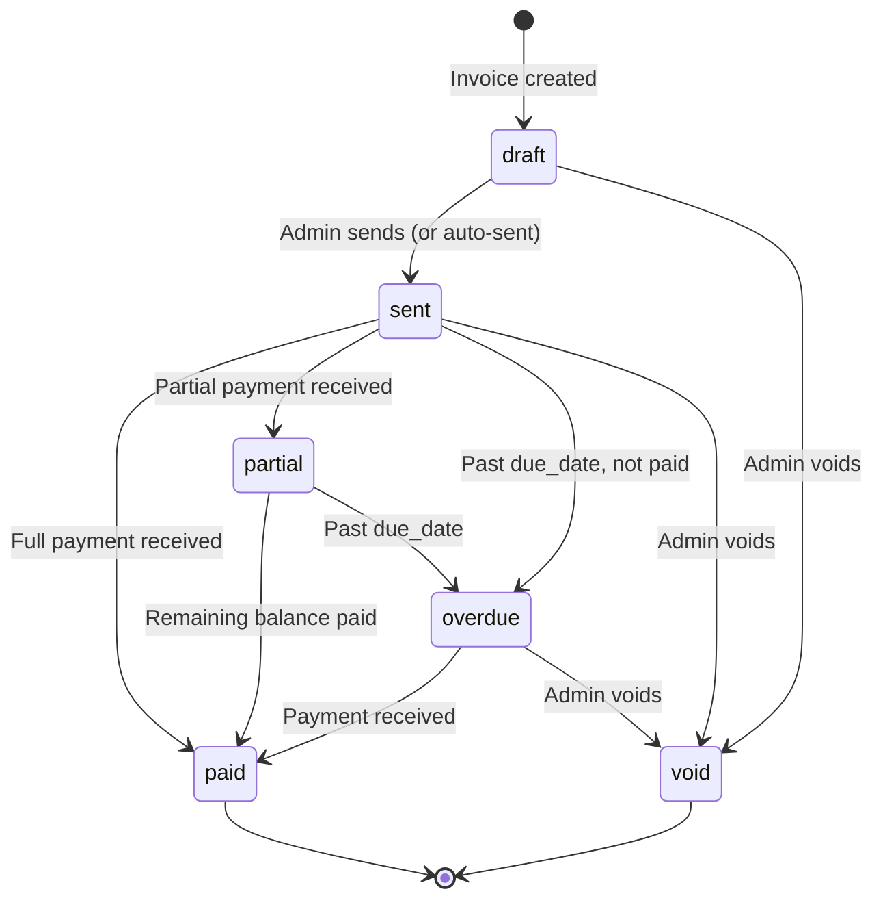
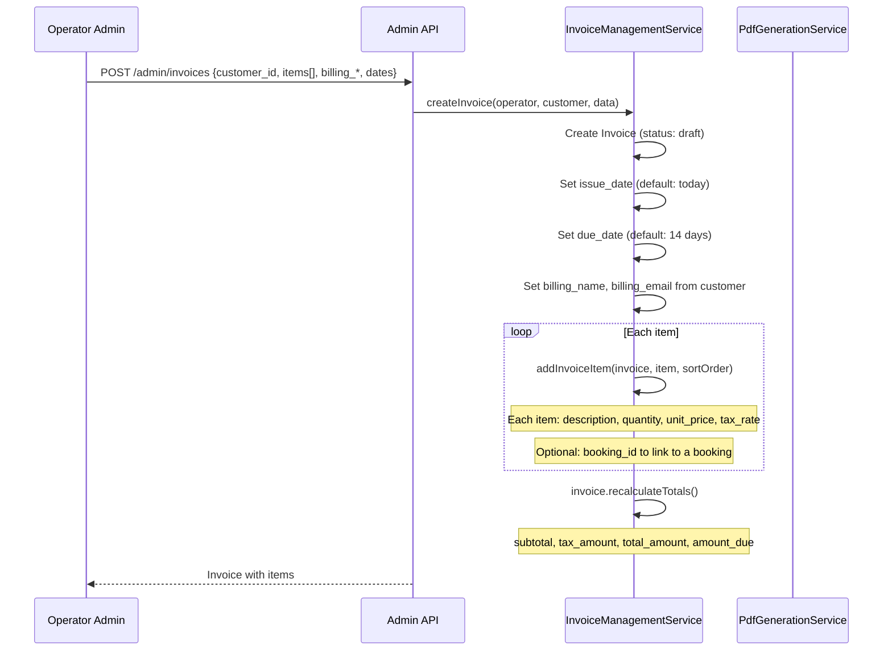
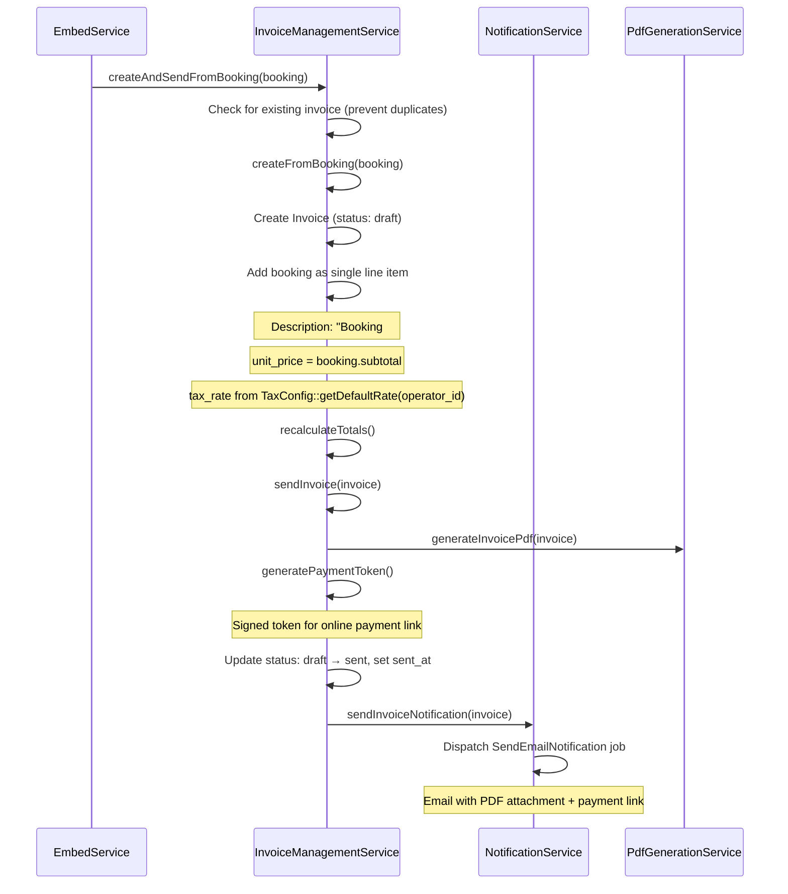
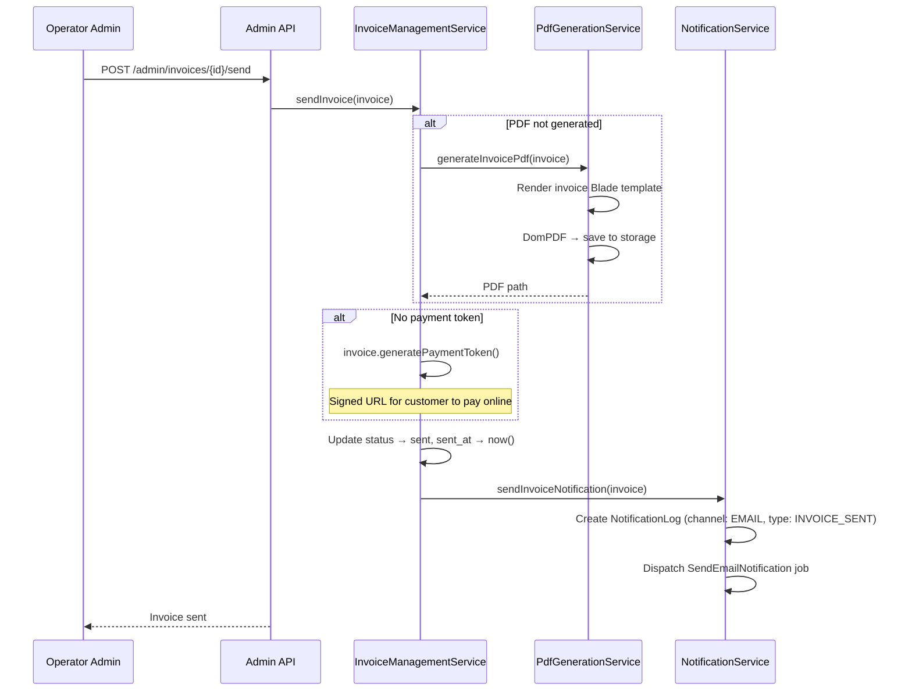
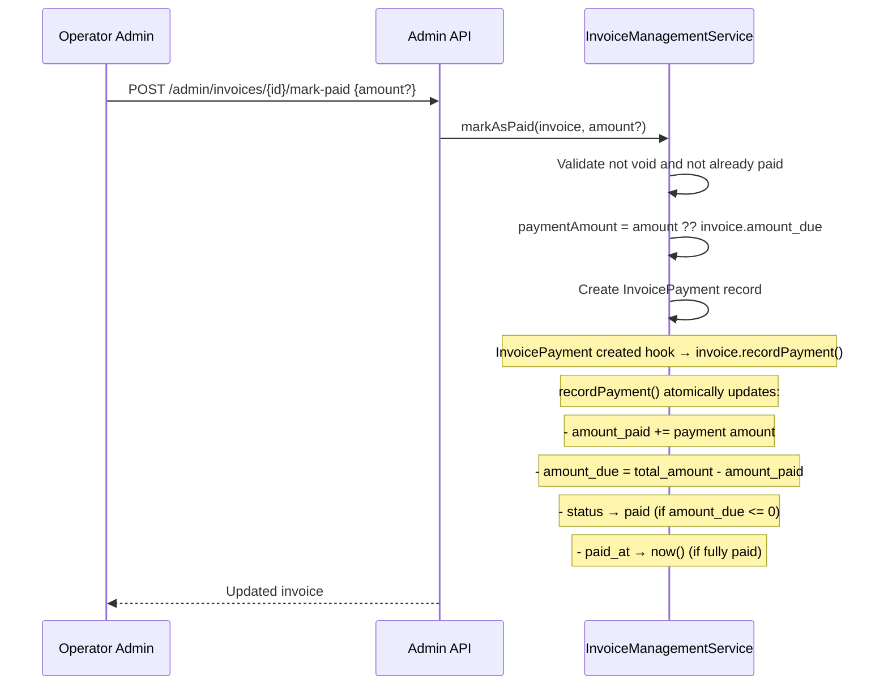
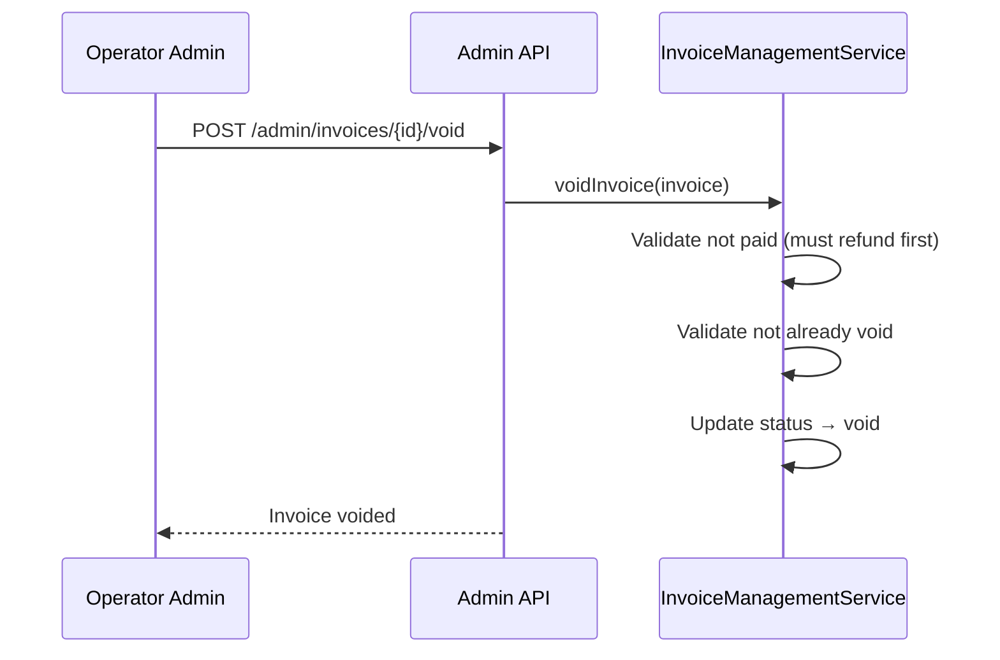
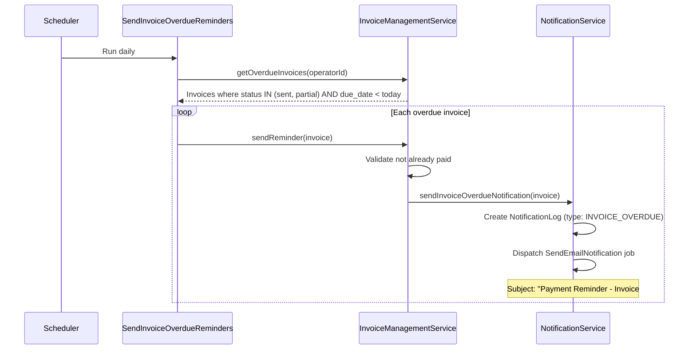
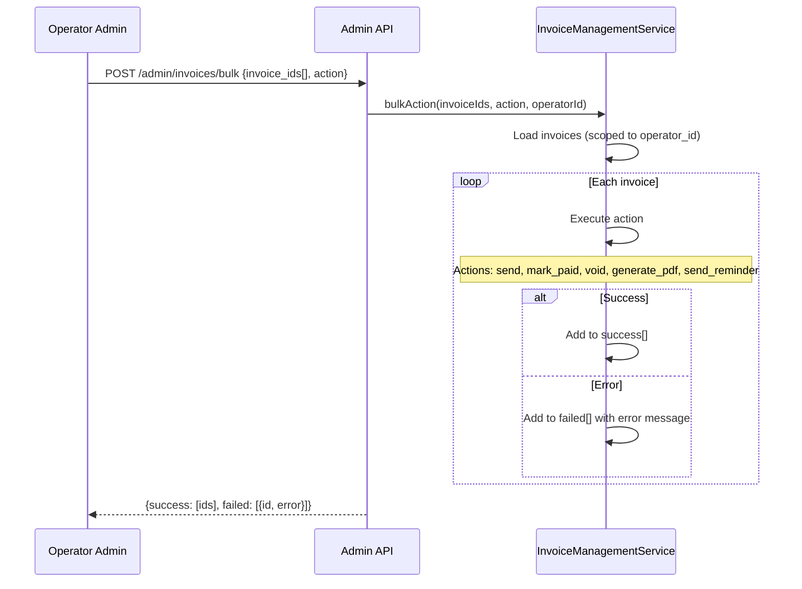

# Invoice Management Flow

Manual invoice creation, auto-generation from bookings, invoice lifecycle, PDF generation, overdue reminders, and bulk actions.

## Actors

- **Operator Admin** — creates, sends, manages invoices
- **Customer** — receives invoice, pays via payment link
- **System** — auto-generates invoices, sends overdue reminders

## Entry Points

| Channel | URL | Controller |
|---------|-----|------------|
| List invoices | `GET /api/v1/admin/invoices` | `Api\Admin\InvoiceController::index()` |
| Create invoice | `POST /api/v1/admin/invoices` | `Api\Admin\InvoiceController::store()` |
| Update invoice | `PUT /api/v1/admin/invoices/{id}` | `Api\Admin\InvoiceController::update()` |
| Send invoice | `POST /api/v1/admin/invoices/{id}/send` | `Api\Admin\InvoiceController::send()` |
| Send reminder | `POST /api/v1/admin/invoices/{id}/remind` | `Api\Admin\InvoiceController::remind()` |
| Mark as paid | `POST /api/v1/admin/invoices/{id}/mark-paid` | `Api\Admin\InvoiceController::markPaid()` |
| Void invoice | `POST /api/v1/admin/invoices/{id}/void` | `Api\Admin\InvoiceController::void()` |
| Generate PDF | `GET /api/v1/admin/invoices/{id}/pdf` | `Api\Admin\InvoiceController::pdf()` |
| Bulk action | `POST /api/v1/admin/invoices/bulk` | `Api\Admin\InvoiceController::bulk()` |
| Unbilled bookings | `GET /api/v1/admin/invoices/unbilled` | `Api\Admin\InvoiceController::unbilled()` |
| Statistics | `GET /api/v1/admin/invoices/stats` | `Api\Admin\InvoiceController::stats()` |
| Auto-generate (widget) | Internal | `InvoiceManagementService::createAndSendFromBooking()` |

## Invoice Lifecycle



## Manual Invoice Creation



## Auto-Generated from Booking

When a widget booking uses `payment_method: invoice`, the invoice is auto-created and sent:



## Sending an Invoice



## Mark as Paid



## Void Invoice



## Overdue Reminders



## Bulk Actions



**Available bulk actions:**

| Action | Description |
|--------|-------------|
| `send` | Send all selected invoices |
| `mark_paid` | Mark all as paid |
| `void` | Void all selected |
| `generate_pdf` | Regenerate PDFs |
| `send_reminder` | Send overdue reminders |

## Invoice Statistics

```
GET /api/v1/admin/invoices/stats
```

Returns:

| Metric | Description |
|--------|-------------|
| `total_invoices` | Total invoice count |
| `draft` | Count in draft status |
| `sent` | Count sent but unpaid |
| `paid` | Count fully paid |
| `overdue` | Count past due |
| `total_outstanding` | Sum of unpaid amount_due |
| `total_paid_this_month` | Revenue from paid invoices this month |

## Unbilled Bookings

```
GET /api/v1/admin/invoices/unbilled?customer_id=X&from=YYYY-MM-DD&to=YYYY-MM-DD&group_by=service_type
```

Returns completed bookings that have no associated InvoiceItems, optionally grouped by service type.

## PDF Generation

Invoices use DomPDF via `PdfGenerationService::generateInvoicePdf()`:

- Template: `resources/views/pdf/invoice.blade.php`
- Includes: operator logo, billing details, line items, totals, payment terms
- Stored at: `storage/app/invoices/{operator_id}/{invoice_number}.pdf`
- Re-generated on invoice update (old PDF path + payment token cleared)

## Auto-Generated Invoice Numbers

Format: `INV-YYYYMM-XXXX` (e.g., `INV-202603-0042`)

Generated by the Invoice model's `generating` event, using a counter scoped to operator + month.

## Events Fired

| Event Type | When |
|------------|------|
| `INVOICE_SENT` | Invoice emailed to customer |
| `INVOICE_OVERDUE` | Overdue reminder sent |
| `INVOICE_PAID` | Invoice fully paid |

## Key Files

| Purpose | File |
|---------|------|
| Invoice management service | `app/Payment/Services/InvoiceManagementService.php` |
| PDF generation | `app/Services/PdfGenerationService.php` |
| Invoice model | `app/Payment/Models/Invoice.php` |
| InvoiceItem model | `app/Payment/Models/InvoiceItem.php` |
| InvoicePayment model | `app/Payment/Models/InvoicePayment.php` |
| Invoice controller | `app/Http/Controllers/Api/Admin/InvoiceController.php` |
| Overdue reminders job | `app/Payment/Jobs/SendInvoiceOverdueReminders.php` |
| PDF template | `resources/views/pdf/invoice.blade.php` |
| Notification service | `app/Notification/Services/NotificationService.php` |
