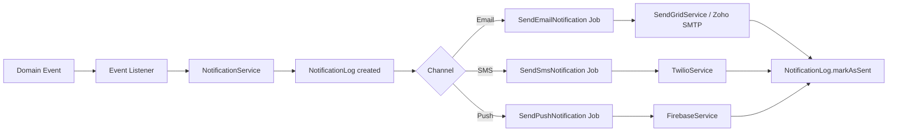
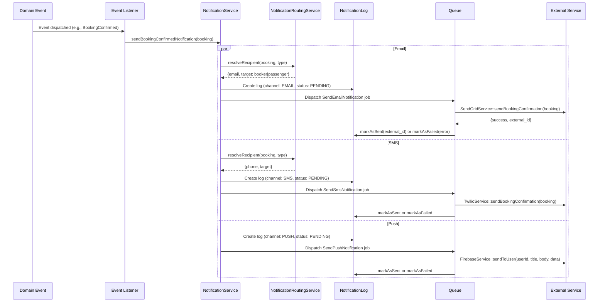
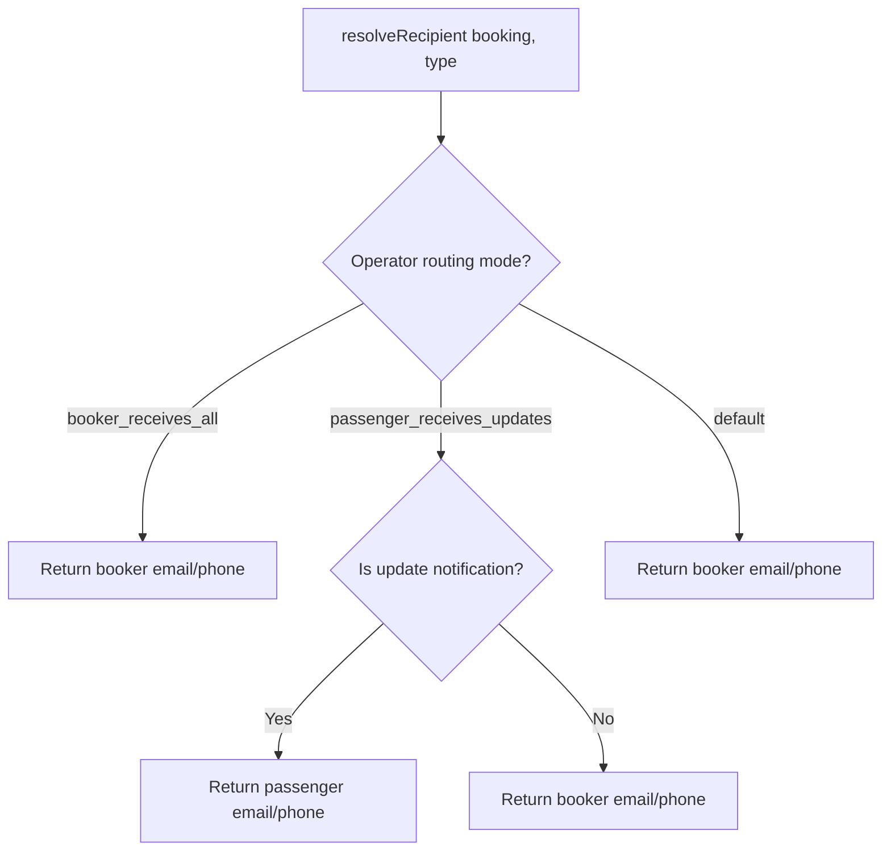
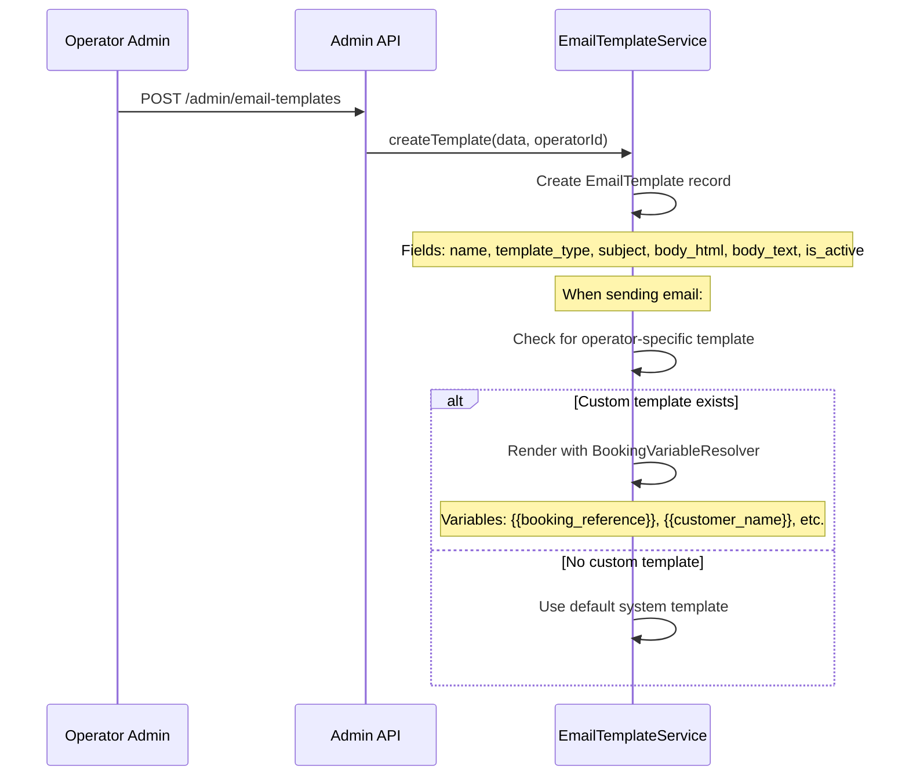
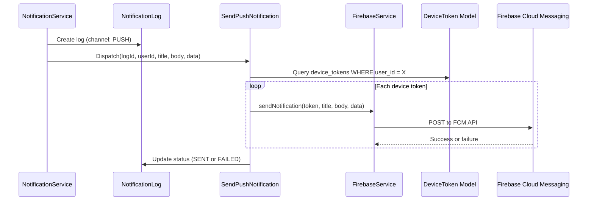
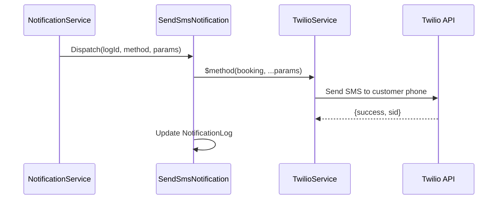

# Notification System Flow

Event-driven notification pipeline: Event -> Listener -> NotificationService -> Job -> External Service. Supports email (Zoho SMTP), SMS (Twilio), and push notifications (Firebase FCM).

## Actors

- **System** — dispatches notifications based on booking events
- **Customer** — receives booking updates via email, SMS, push
- **Driver** — receives job offers and assignments via push, email
- **Operator Admin** — receives admin alerts, manages email templates

## Entry Points

| Channel | URL | Controller |
|---------|-----|------------|
| Email templates | `GET /api/v1/admin/email-templates` | `Api\Admin\EmailTemplateController::index()` |
| Create template | `POST /api/v1/admin/email-templates` | `Api\Admin\EmailTemplateController::store()` |
| Update template | `PUT /api/v1/admin/email-templates/{id}` | `Api\Admin\EmailTemplateController::update()` |
| Notification preferences | `PATCH /api/v1/settings/notifications` | `Api\V1\SettingsController` |
| Device token registration | `POST /api/v1/device-tokens` | `Api\V1\DeviceTokenController::store()` |

## Architecture

## Notification Pipeline (Detail)

## Full Event-to-Notification Mapping

### Customer Notifications

| Event / Trigger | Email | SMS | Push | Service Method |
|----------------|-------|-----|------|---------------|
| Quote sent to customer | Yes (`sendQuote`) | Yes (`sendQuoteReady`) | No | `sendQuoteNotification()` |
| Booking received (payment confirmed) | Yes (`sendPaymentConfirmation`) | Yes | No | `sendBookingReceivedNotification()` |
| Booking confirmed | Yes (`sendBookingConfirmation`) | Yes | Yes | `sendBookingConfirmedNotification()` |
| Booking cancelled | Yes (`sendBookingCancellation`) | Yes (`sendBookingCancelledSms`) | Yes | `sendBookingCancelledNotification()` |
| Booking rejected | Yes (`sendBookingRejection`) | Yes (`sendBookingRejectedSms`) | No | `sendBookingRejectedNotification()` |
| Driver assigned | Yes (`sendDriverAssigned`) | Yes | Yes | `sendDriverAssignedNotification()` |
| Driver on the way | No | Yes (`sendDriverOnTheWay` + ETA) | No | `sendDriverOnWayNotification()` |
| Driver arrived | No | Yes (`sendDriverArrived`) | No | `sendDriverArrivedNotification()` |
| Payment received | Yes (`sendPaymentConfirmation`) | Yes | No | `sendPaymentReceivedNotification()` |
| Refund processed | Yes (`sendRefundProcessed`) | No | No | `sendRefundProcessedNotification()` |
| Booking reminder | Yes (`sendBookingReminder`) | Yes (`sendBookingReminderSms`) | Yes | `sendBookingReminderNotification()` |
| Modification approved | Yes (`sendModificationApproved`) | No | No | `sendModificationApprovedNotification()` |
| Modification rejected | Yes (`sendModificationRejected`) | No | No | `sendModificationRejectedNotification()` |

### Driver Notifications

| Event / Trigger | Email | SMS | Push | Service Method |
|----------------|-------|-----|------|---------------|
| Job offer broadcast | No | No | Yes | `sendJobOfferNotification()` |
| Job accepted confirmation | No | No | Yes | `sendJobAcceptedConfirmation()` |
| Job taken by another driver | No | No | Yes | `sendJobTakenNotification()` |
| Job offer cancelled | No | No | Yes | `sendJobOfferCancelledNotification()` |
| Job assigned (manual/auto) | Yes (if enabled) | No | Yes | `sendJobAssignedToDriverNotification()` |

### Admin Notifications

| Event / Trigger | Email | SMS | Push | Service Method |
|----------------|-------|-----|------|---------------|
| New quote request | Yes (`sendNewQuoteToAdmin`) | No | No | `sendQuoteRequestNotification()` |
| No drivers available | No | No | Yes | `sendAdminNoDriversNotification()` |
| Customer message reply | No | No | Yes | `sendCustomerReplyNotification()` |

### Invoice Notifications

| Event / Trigger | Email | SMS | Push | Service Method |
|----------------|-------|-----|------|---------------|
| Invoice sent | Yes (with PDF attachment) | No | No | `sendInvoiceNotification()` |
| Invoice overdue | Yes | No | No | `sendInvoiceOverdueNotification()` |

### Corporate CC Notifications

| Event / Trigger | Email | SMS | Push | Service Method |
|----------------|-------|-----|------|---------------|
| Booking confirmed (CC to company) | Yes | No | No | `sendBookingConfirmedCcNotification()` |

## Notification Routing

The `NotificationRoutingService` determines **who** receives each notification:

- **Booker** = `booking.user` (the person who made the booking)
- **Passenger** = `booking.passenger_email` / `booking.passenger_phone` (the person riding)

This matters for "booking for others" scenarios where booker and passenger are different.

## Email Template System

Operators can customize email templates per notification type:

**Template types** match notification types (e.g., `booking_confirmed`, `quote_sent`, `driver_assigned`).

## Push Notification via Firebase

**Push notification data payload:**

| Field | Description |
|-------|-------------|
| `booking_id` | Booking ID for deep linking |
| `type` | Notification type (e.g., `job_offer`, `booking_confirmed`) |
| `job_offer_id` | Job offer ID (for offer notifications) |
| `message_id` | Message ID (for reply notifications) |

## SMS via Twilio

## Notification Preferences

Customers can configure notification preferences via settings:

| Preference | Description |
|-----------|-------------|
| Email notifications | Enable/disable all email notifications |
| SMS notifications | Enable/disable all SMS notifications |
| Push notifications | Enable/disable all push notifications |
| Booking reminders | Enable/disable reminder notifications |

Drivers have a separate `email_notifications_enabled` flag on their Driver model.

## NotificationType Enum Values

| Category | Types |
|----------|-------|
| Quote | `quote_requested`, `quote_sent` |
| Booking | `booking_received`, `booking_confirmed`, `booking_rejected`, `booking_cancelled` |
| Driver | `driver_assigned`, `driver_on_way`, `driver_arrived` |
| Payment | `payment_received`, `payment_failed`, `refund_processed` |
| Invoice | `invoice_sent`, `invoice_paid`, `invoice_overdue` |
| Push-specific | `booking_reminder`, `job_assigned`, `job_offer` |
| Admin | `no_drivers_available` |
| Modification | `modification_approved`, `modification_rejected` |
| Messaging | `booking_message`, `customer_reply` |

## NotificationLog Model

| Field | Description |
|-------|-------------|
| `user_id` | Recipient user ID |
| `booking_id` | Related booking (nullable) |
| `channel` | `email`, `sms`, `push` |
| `type` | NotificationType enum value |
| `recipient` | Email address, phone number, or `push:{user_id}` |
| `subject` | Email subject or push title |
| `status` | `pending`, `sent`, `failed` |
| `external_id` | External service reference (SendGrid ID, Twilio SID) |
| `error` | Error message if failed |

## Key Files

| Purpose | File |
|---------|------|
| Notification service | `app/Notification/Services/NotificationService.php` |
| Routing service | `app/Notification/Services/NotificationRoutingService.php` |
| Email template service | `app/Notification/Services/EmailTemplateService.php` |
| Variable resolver | `app/Notification/Services/BookingVariableResolver.php` |
| NotificationType enum | `app/Notification/Enums/NotificationType.php` |
| NotificationChannel enum | `app/Notification/Enums/NotificationChannel.php` |
| NotificationStatus enum | `app/Notification/Enums/NotificationStatus.php` |
| NotificationLog model | `app/Notification/Models/NotificationLog.php` |
| DeviceToken model | `app/Notification/Models/DeviceToken.php` |
| EmailTemplate model | `app/Notification/Models/EmailTemplate.php` |
| Send email job | `app/Notification/Jobs/SendEmailNotification.php` |
| Send SMS job | `app/Notification/Jobs/SendSmsNotification.php` |
| Send push job | `app/Notification/Jobs/SendPushNotification.php` |
| SendGrid service | `app/Services/External/SendGridService.php` |
| Twilio service | `app/Services/External/TwilioService.php` |
| Firebase service | `app/Services/External/FirebaseService.php` |
