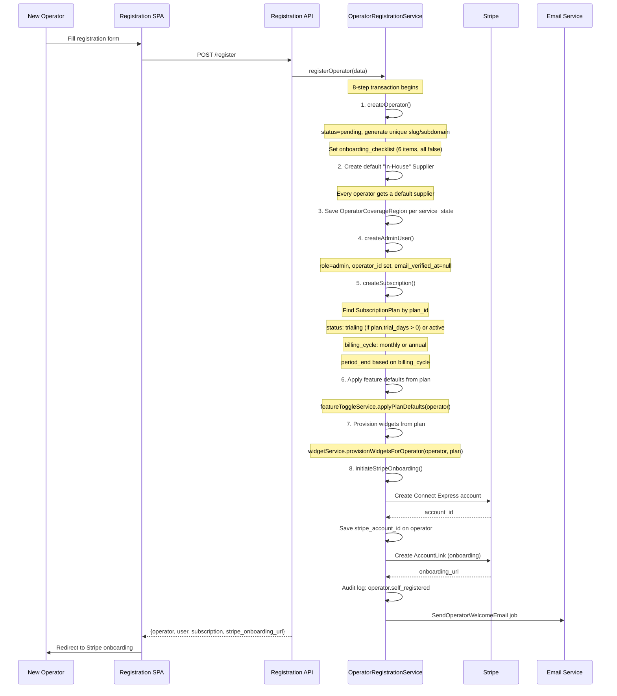
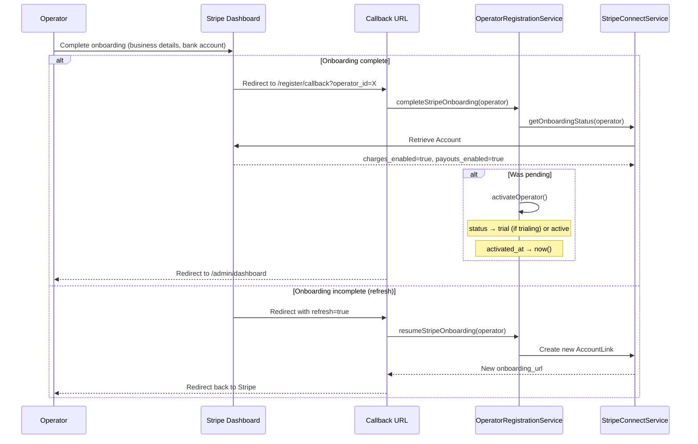
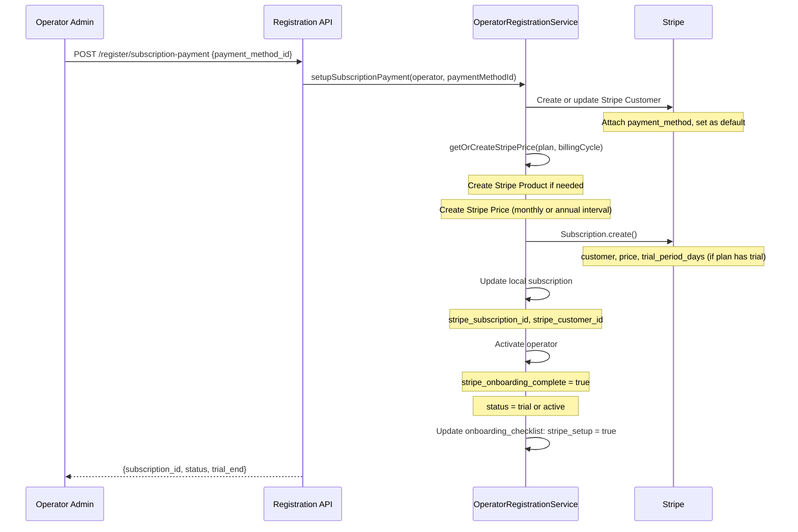
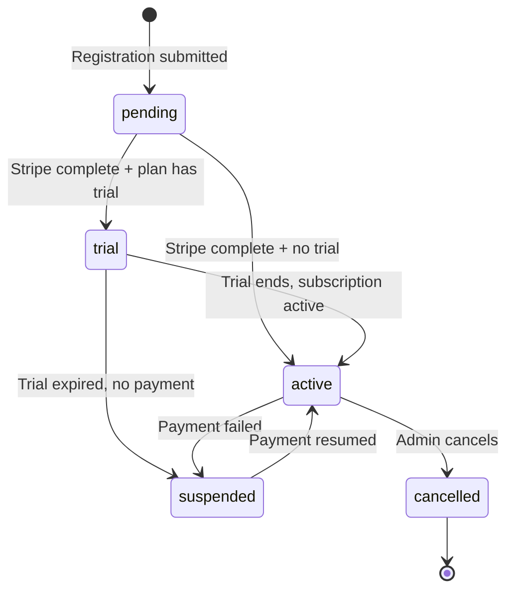

# Operator Registration Flow

Self-service operator signup: registration form, plan selection, Stripe Connect onboarding, and post-registration activation.

## Actors

- **New Operator** — fills registration form, completes Stripe setup
- **System** — creates operator, subscription, provisions widgets
- **Stripe** — handles payment onboarding
- **Super Admin** — can manage operators after registration

## Entry Points

| Channel | URL | Controller |
|---------|-----|------------|
| Registration page | `GET /register` | `Web\RegistrationController` (Inertia) |
| Submit registration | `POST /api/register` | `OperatorRegistrationController::register()` |
| Stripe callback | `GET /register/callback` | `OperatorRegistrationController::callback()` |
| Setup payment | `POST /api/register/subscription-payment` | `OperatorRegistrationController::setupPayment()` |
| Resume onboarding | `POST /api/register/resume-onboarding` | `OperatorRegistrationController::resumeOnboarding()` |
| Available plans | `GET /api/register/plans` | `OperatorRegistrationController::plans()` |
| Check email | `POST /api/register/check-email` | `OperatorRegistrationController::checkEmail()` |

## Registration Flow



## Stripe Connect Onboarding



## Subscription Payment Setup

After Stripe Connect onboarding, operator sets up subscription billing:



## Post-Registration State

After successful registration, the operator has:

| Item | Status |
|------|--------|
| Operator record | `pending` (until Stripe complete) → `trial` or `active` |
| Admin user | Created, email not verified |
| Default supplier | "In-House" supplier created |
| Subscription | `trialing` or `active` based on plan |
| Feature toggles | Plan defaults applied |
| Widget configs | Provisioned from plan templates |
| Stripe Connect | Account created, onboarding link provided |
| Onboarding checklist | 6 items, `stripe_setup` marked after payment |

## Onboarding Checklist

```json
{
    "stripe_setup": false,
    "add_vehicle_type": false,
    "add_vehicle": false,
    "add_driver": false,
    "configure_pricing": false,
    "test_booking": false
}
```

Each item is checked off as the operator completes setup in their admin portal.

## Operator Status Transitions



## Email Validation

| Check | Service Method |
|-------|---------------|
| Operator email available | `isOperatorEmailAvailable(email)` — checks `operators.email` |
| Admin email available | `isAdminEmailAvailable(email)` — checks `users.email` where role IN (admin, super_admin) |

Note: Customer emails are per-operator unique, so a customer email in another operator does NOT conflict.

## Super Admin Operator Management

After registration, super admins can manage operators through the Super Admin SPA:

| Action | Description |
|--------|-------------|
| View operators | List all operators with status, plan, Stripe status |
| Cancel operator | Set status to cancelled |
| Suspend operator | Set status to suspended |
| Delete operator | Soft delete |
| Restore operator | Restore soft-deleted operator |
| Force delete | Permanent deletion (cascade) |
| Impersonate | Login as operator admin |

## Events Fired

| Event | When |
|-------|------|
| `operator.self_registered` | Registration transaction complete (audit log) |
| `operator.stripe_connect.account_created` | Stripe Connect account created |
| `operator.stripe_connect.onboarding_started` | Onboarding link generated |
| `operator.stripe_connect.onboarding_completed` | Stripe onboarding verified |
| `operator.activated_self_service` | Operator status changed to active |
| `operator.subscription_payment_setup` | Subscription payment configured |

## Key Files

| Purpose | File |
|---------|------|
| Registration service | `app/Services/OperatorRegistrationService.php` |
| Registration controller | `app/Http/Controllers/OperatorRegistrationController.php` |
| Registration request | `app/Http/Requests/OperatorRegistrationRequest.php` |
| Stripe Connect service | `app/Payment/Services/StripeConnectService.php` |
| Widget provisioning | `app/Embed/Services/WidgetProvisioningService.php` |
| Feature toggle service | `app/Services/FeatureToggleService.php` |
| Subscription management | `app/Services/SubscriptionManagementService.php` |
| Operator management | `app/Services/OperatorManagementService.php` |
| Welcome email job | `app/Jobs/SendOperatorWelcomeEmail.php` |
| Operator model | `app/Models/Operator.php` |
| Subscription model | `app/Models/OperatorSubscription.php` |
| Registration test | `tests/Feature/OperatorRegistrationTest.php` |
