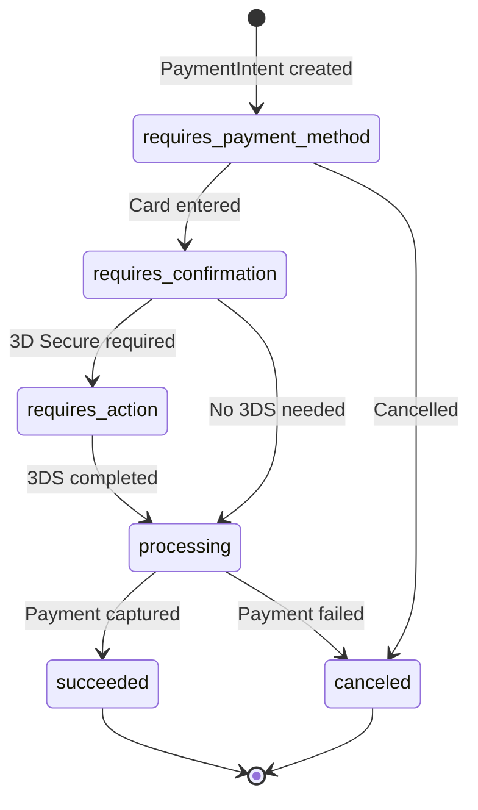
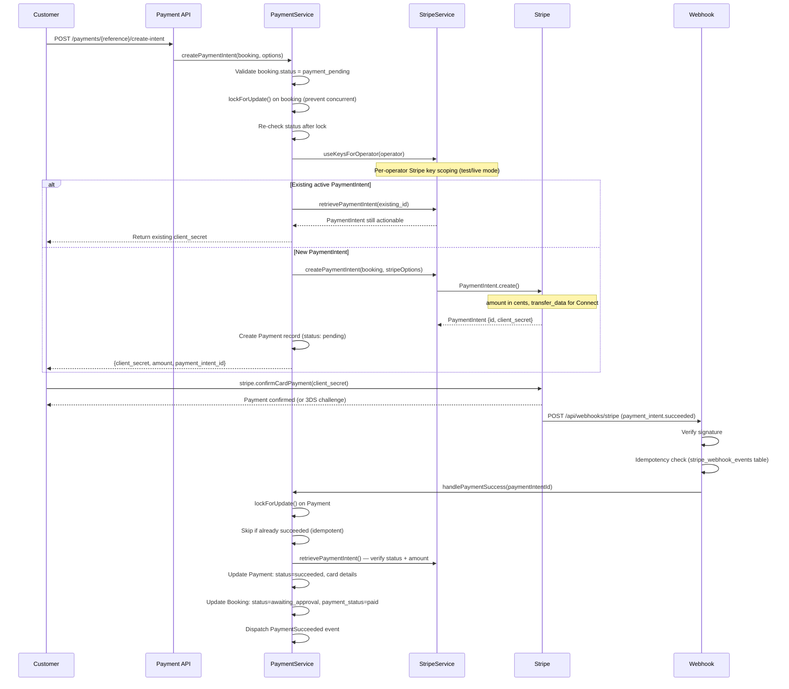
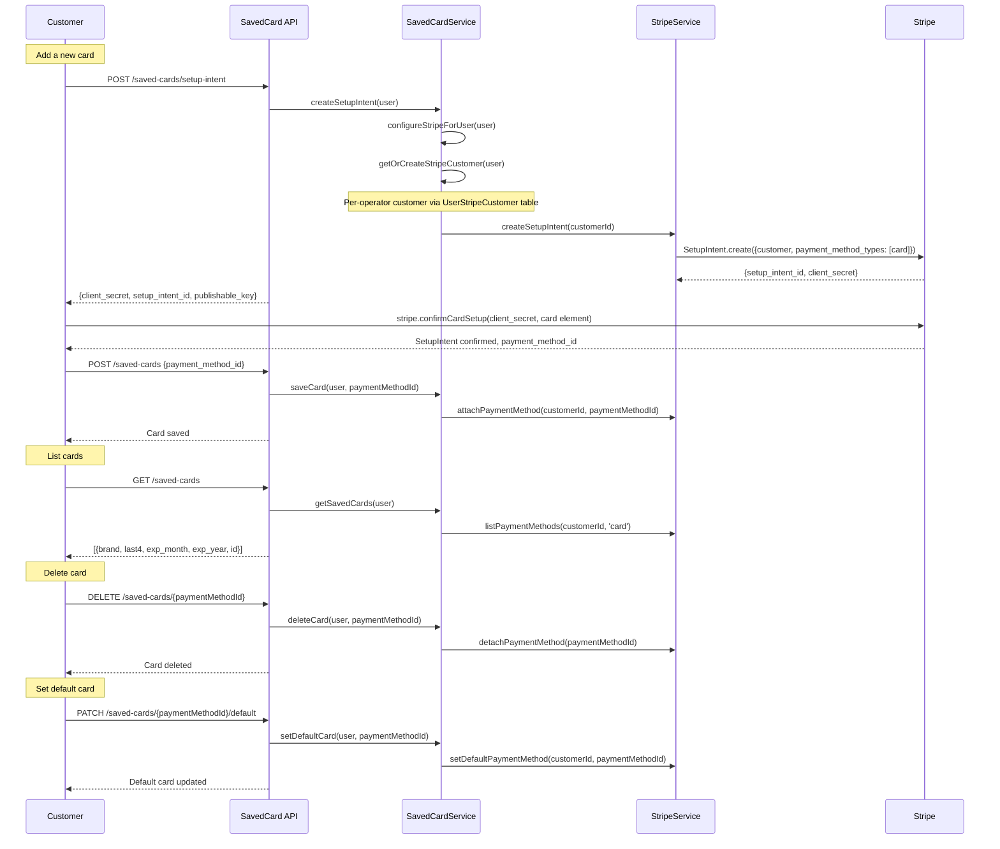
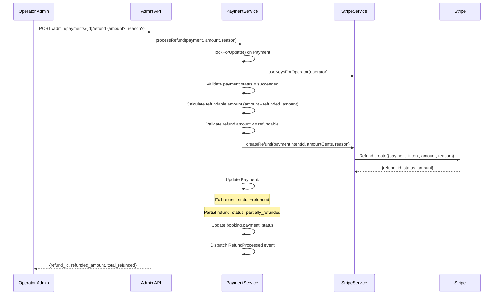
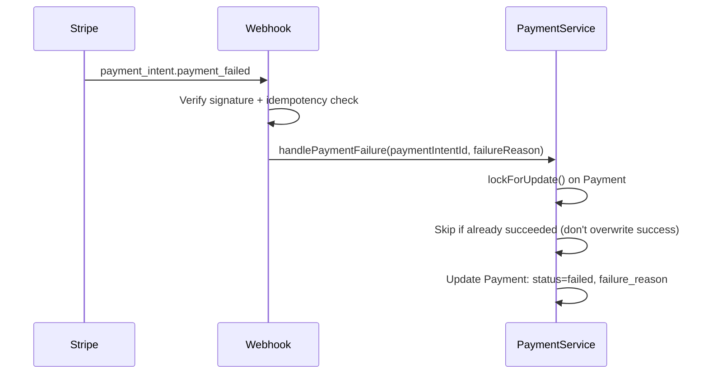
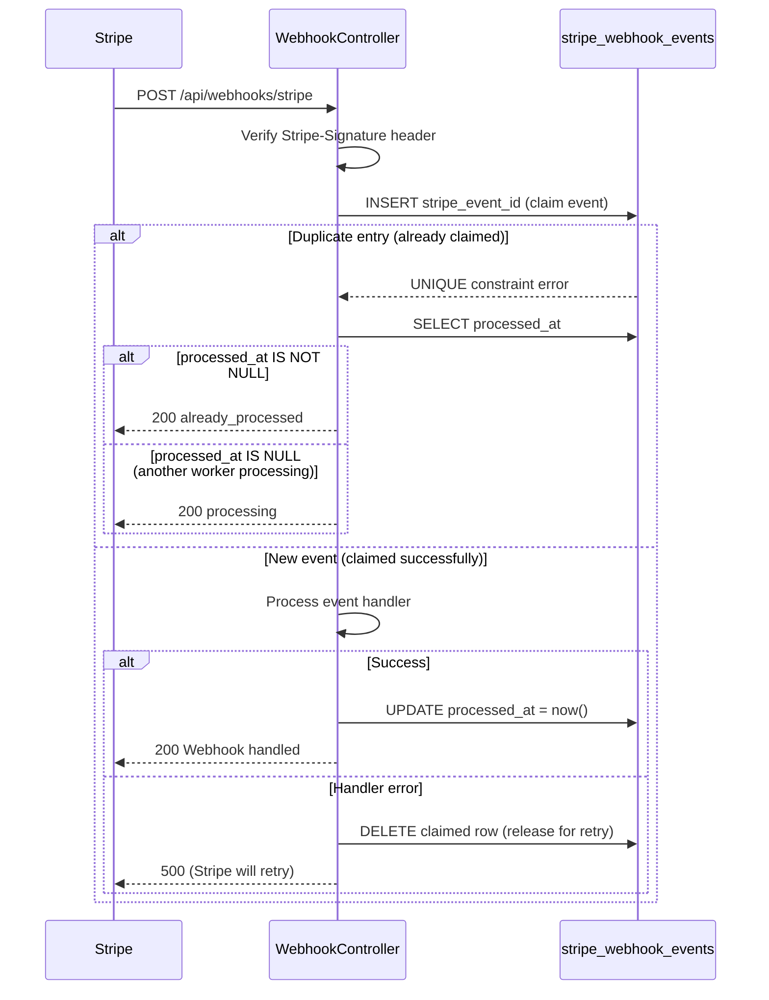

# Payment Processing Flow

Stripe PaymentIntent lifecycle, saved cards CRUD, refunds, Stripe Connect for operators, and webhook handling with idempotency.

## Actors

- **Customer** — pays for bookings via card, views saved cards
- **Operator Admin** — processes refunds, views payment history
- **Stripe** — processes payments, sends webhooks
- **System** — handles webhooks, manages payment state

## Entry Points

| Channel | URL | Controller |
|---------|-----|------------|
| Create PaymentIntent | `POST /api/v1/payments/{reference}/create-intent` | `Api\V1\PaymentController::createIntent()` |
| Confirm payment | `POST /api/v1/payments/{reference}/confirm` | `Api\V1\PaymentController::confirm()` |
| Widget PaymentIntent | `POST /api/v1/widget/payment-intent` | `Widget\WidgetApiController::createPaymentIntent()` |
| Stripe webhook | `POST /api/webhooks/stripe` | `Api\WebhookController::handleStripe()` |
| Process refund | `POST /api/v1/admin/payments/{id}/refund` | `Api\Admin\PaymentController::refund()` |
| List saved cards | `GET /api/v1/saved-cards` | `Api\V1\SavedCardController::index()` |
| Add saved card | `POST /api/v1/saved-cards/setup-intent` | `Api\V1\SavedCardController::createSetupIntent()` |
| Delete saved card | `DELETE /api/v1/saved-cards/{paymentMethodId}` | `Api\V1\SavedCardController::destroy()` |

## Stripe PaymentIntent Lifecycle



## Payment Flow — Customer Booking



## Per-Operator Stripe Key Scoping

Every Stripe call uses operator-specific keys via `StripeService::useKeysForOperator()`:

```mermaid
flowchart TD
    A[Stripe API Call] --> B[StripeService::useKeysForOperator]
    B --> C{Platform settings exist?}
    C -->|No| D[Use default config keys]
    C -->|Yes| E{operator.stripe_mode}
    E -->|test| F[Use test_secret / test_key]
    E -->|live| G[Use live_secret / live_key]
    F --> H[Set currentSecretKey + currentPublishableKey]
    G --> H
    H --> I[All SDK calls use requestOptions with per-request api_key]
    Note over I: Avoids Stripe::setApiKey() race condition under Octane
```

## Stripe Connect (Destination Charges)

For operators with Stripe Connect accounts, payments use destination charges:

```
PaymentIntent.create({
    amount: ...,
    transfer_data: {
        destination: operator.stripe_account_id
    }
})
```

Only added when `stripe_account_id` exists and is NOT a test placeholder (`acct_test_*`).

## Saved Cards CRUD



## Refund Flow



## Payment Failure Handling



## Webhook Handling with Idempotency



**Handled webhook events:**

| Event | Handler |
|-------|---------|
| `payment_intent.succeeded` | `PaymentService::handlePaymentSuccess()` |
| `payment_intent.payment_failed` | `PaymentService::handlePaymentFailure()` |
| `charge.refunded` | Logged (refunds handled synchronously) |

## Payment Status Enum

| Status | Value | Description |
|--------|-------|-------------|
| Pending | `pending` | PaymentIntent created, awaiting confirmation |
| Processing | `processing` | Being processed by Stripe |
| Requires Action | `requires_action` | 3D Secure or similar required |
| Succeeded | `succeeded` | Payment captured successfully |
| Failed | `failed` | Payment failed |
| Cancelled | `cancelled` | PaymentIntent cancelled |
| Refunded | `refunded` | Fully refunded |
| Partially Refunded | `partially_refunded` | Partially refunded |

## Events Fired

| Event | When | Listeners |
|-------|------|-----------|
| `PaymentSucceeded` | Card payment confirmed | `SendPaymentConfirmation` |
| `PaymentFailed` | Payment failed | Logged |
| `RefundProcessed` | Refund completed | `SendRefundProcessedNotification` |

## Key Files

| Purpose | File |
|---------|------|
| Payment service | `app/Payment/Services/PaymentService.php` |
| Stripe service | `app/Services/External/StripeService.php` |
| Stripe Connect service | `app/Payment/Services/StripeConnectService.php` |
| Saved card service | `app/Payment/Services/SavedCardService.php` |
| Webhook controller | `app/Http/Controllers/Api/WebhookController.php` |
| Payment model | `app/Payment/Models/Payment.php` |
| Payment status enum | `app/Payment/Enums/PaymentStatus.php` |
| Payment events | `app/Payment/Events/` |
| Payment listeners | `app/Payment/Listeners/` |
| User Stripe customer | `app/Payment/Models/UserStripeCustomer.php` |
