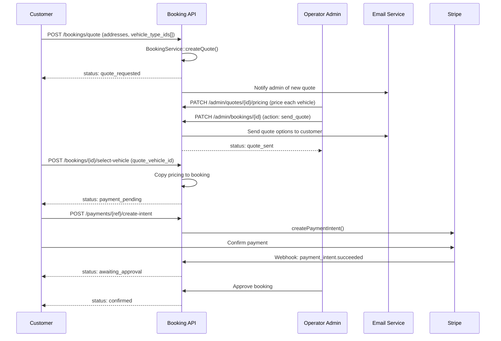
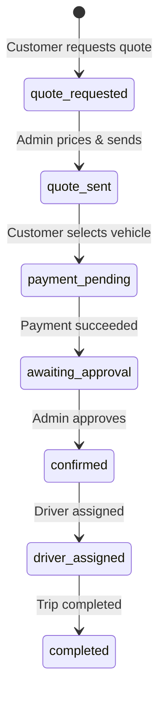

# Quote Request Flow

Customer requests pricing for multiple vehicles. Admin prices each option. Customer selects and pays.

## Actors

- **Customer** — requests quote, selects vehicle, pays
- **Operator Admin** — prices vehicles, sends quote

## Entry Points

| Channel | URL | Controller |
|---------|-----|------------|
| SPA | `POST /api/v1/bookings/quote` | `Api\V1\BookingController::storeQuote()` |
| Widget | `POST /api/v1/widget/quotes` | `Widget\WidgetApiController::createQuote()` |
| Embed | `POST /api/v1/embed/quotes` | `Embed\EmbedController::createQuote()` |

## Flow Diagram



## Status Progression



## Step-by-Step

### 1. Customer Requests Quote

```
POST /api/v1/bookings/quote
```

| Field | Required | Description |
|-------|----------|-------------|
| `vehicle_type_ids` | Yes | Array of vehicle type IDs to compare (2-4 typical) |
| All trip fields | Yes | Same as direct booking (addresses, datetime, passengers) |

**Service:** `BookingService::createQuote($data, $user)`
- Creates booking with `booking_type = 'quote'`, `status = 'quote_requested'`
- Creates `QuoteVehicle` record per vehicle (pricing = 0, placeholder)
- Records `QUOTE_REQUESTED` event

### 2. Admin Prices Each Vehicle

```
PATCH /api/v1/admin/quotes/{booking_id}/pricing
```

| Field | Description |
|-------|-------------|
| `vehicles[].quote_vehicle_id` | ID of quote vehicle |
| `vehicles[].base_fare` | Base price |
| `vehicles[].distance_fare` | Distance charge |
| `vehicles[].time_fare` | Time charge |
| `vehicles[].extras_fare` | Extras charge |
| `vehicles[].total_amount` | Total for this vehicle |

### 3. Admin Sends Quote

```
PATCH /api/v1/admin/bookings/{id}  (action: send_quote)
```

- Validates at least one vehicle is priced
- Transitions: `quote_requested` → `quote_sent`
- Sends email to customer with pricing options

### 4. Customer Selects Vehicle

```
POST /api/v1/bookings/{id}/select-vehicle
```

| Field | Required | Description |
|-------|----------|-------------|
| `quote_vehicle_id` | Yes | ID of selected QuoteVehicle |

**Process:**
- Locks booking (`lockForUpdate`)
- Marks QuoteVehicle as selected
- Copies pricing into booking fields
- Transitions: `quote_sent` → `payment_pending`

### 5. Payment

Same as [Public Booking payment flow](booking-public.md#3-payment-if-card).

## Events Fired

| Event Type | When |
|------------|------|
| `QUOTE_REQUESTED` | Quote created |
| `QUOTE_SENT` | Admin sends to customer |
| `QUOTE_VEHICLE_SELECTED` | Customer picks vehicle |
| `PAYMENT_SUCCEEDED` | Payment confirmed |

## Key Files

| Purpose | File |
|---------|------|
| Quote creation | `app/Booking/Services/BookingService.php` → `createQuote()` |
| Quote pricing | `app/Http/Controllers/Api/Admin/QuoteController.php` |
| Vehicle selection | `app/Http/Controllers/Api/V1/BookingController.php` → `selectVehicle()` |
| QuoteVehicle model | `app/Booking/Models/QuoteVehicle.php` |
